# WordGesture-GAN: Modeling Word-Gesture Movement with Generative Adversarial Network

## ABSTRACT

Word-gesture production models that can synthesize word-gestures are critical to the training and evaluation of word-gesture keyboard decoders. We propose WordGesture-GAN, a conditional generative adversarial network that takes arbitrary text as input to generate realistic word-gesture movements in both spatial (i.e., (x, y) coordinates of touch points) and temporal (i.e., timestamps of touch points) dimensions. WordGesture-GAN introduces a Variational Auto-Encoder to extract and embed variations of user-drawn gestures into a Gaussian distribution which can be sampled to control variation in generated gestures. Our experiments on a dataset with 38k gesture samples show that WordGesture-GAN outperforms existing gesture production models including the minimum jerk model [\[37\]](#page-13-0) and the style-transfer GAN [\[31,](#page-13-1) [32\]](#page-13-2) in generating realistic gestures. Overall, our research demonstrates that the proposed GAN structure can learn variations in user-drawn gestures, and the resulting WordGesture-GAN can generate word-gesture movement and predict the distribution of gestures. WordGesture-GAN can serve as a valuable tool for designing and evaluating gestural input systems.

## 1. INTRODUCTION

A word-gesture [\[22,](#page-13-3) [49\]](#page-14-1) is a continuous stroke defned on a virtual keyboard connecting letters of a given word. Drawing wordgestures over a virtual keyboard is an important alternative to tap-typing for entering text on mobile devices (variously known as Gesture Typing, Swipe Typing, Glide Typing and Shape Writing). It has been widely adopted on major consumer products including Google's Gboard[\[28\]](#page-13-4), Microsoft's SwiftKey[\[43\]](#page-14-2), and iOS's built-in keyboard.

This work aims at advancing the state of the art for generative modelling of human word-gesture production. Models that can describe, predict, and simulate human's interaction with computing systems are foundational to developing interface technologies and HCI as an academic feld. Situated in an era of symbolic systems as the dominant form of AI, Card, Moran and Newell [\[7\]](#page-13-5) developed a set of HCI models from human information processing psychology (such as Fitts' law) and rule-based modeling (such as GOMS) that helped to establish HCI as a distinct feld of research. The recent rise and development in deep learning may drive another wave of progress in HCI modeling. In this paper we use GAN (Generative Adversarial Network), an increasingly popular and successful approach to deep learning, as a tool to model human gesture-typing behavior.

Models play three interrelated roles in HCI. First, as a summary of empirical observations or as application of more general theories, models may provide foundational understanding and insights as a vital part of any scientifc feld. Second, models may generalize and predict interaction behaviors beyond the scope of what lab tests and feld studies reveal. Third, models can be used in the design process of user interfaces.

Model building is particularly important for language input technologies such as word-gesture input due to the rich rules and variations in word sequences captured by language models that modern text input systems rely on. Since the invention of this technology [\[22,](#page-13-3) [47\]](#page-14-3) , various gesture models have been developed and applied to word-gesture system design and evaluation. For example, modeling a gesture-stroke as a series of connected curves, lines, and corners, and assuming the duration of drawing a word-gesture is the sum of time cost for each aiming movement, Cao and Zhai [\[6\]](#page-13-6) and Rick [\[39\]](#page-14-4) proposed various time performance models that can predict the duration of drawing word-gestures. Coupled with optimizers, these models have been used to design and search for keyboard layouts for high-efciency word-gesture input [\[5,](#page-13-7) [41\]](#page-14-5).

User-Drawn and Simulated Gestures for the Word "place"

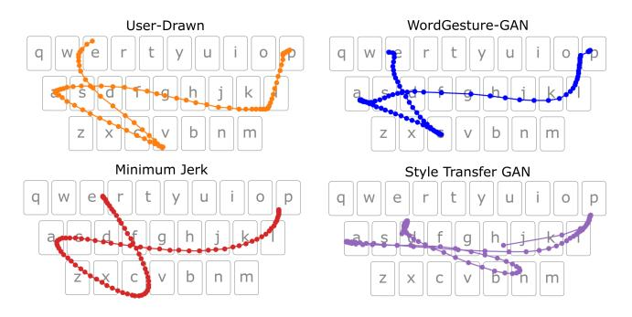

Figure 1: Examples of user-drawn (orange) and simulated gestures for the word "place" by our WordGesture-GAN (blue), minimum jerk model (red)[\[37\]](#page-13-0), and Style-Transfer GAN (purple) [\[31\]](#page-13-1). Dots represent equally spaced touchpoints in time along the gesture. Segments with higher dot density indicate slower movement. As shown, WordGesture-GAN generates movements in both spatial and temporal dimensions, the Minimum Jerk model generates movements in spatial and relative temporal (i.e., assuming the duration of movement of a unit length) dimensions. The original Style-Transfer GAN [\[31,](#page-13-1) [32\]](#page-13-2) generates gestures in the spatial dimension only. We have extended it to both spatial and temporal dimensions (See Section 5.1).

In addition to performance models, production models that can synthesize gesture movements are also critical for gestural input technologies. They can augment the dataset used for the training and evaluation of gesture recognizers (or decoders). For example, Quinn and Zhai [\[37\]](#page-13-0) proposed a minimum jerk model which models word-gesture movement on the human-motor control principle of minimization of jerk – the third derivative of position. This model can predict the shape, trajectory, and relative movement dynamic

(assuming the duration of movement is of a unit length) of wordgesture inputs.

Inspired by the style transfer research in image generation, Mehra et al. [\[31,](#page-13-1) [32\]](#page-13-2) proposed a style-transfer GAN that can synthesize gestures by combining learned drawing styles with user reference input. The gesture input dataset augmented by the synthesized gestures signifcantly improved the accuracy of training word-gesture decoders [\[32\]](#page-13-2).

In this paper, we design and implement WordGesture-GAN, a Generative Adversarial Network (GAN) [\[15\]](#page-13-8) based production model for word-gesture input. WordGesture-GAN introduces a Variational Auto-Encoder to extract and embed the variations of user-drawn gestures into a Gaussian distribution, which can be easily sampled to introduce variations back to generated gestures. More specifcally, WordGesture-GAN introduces variances into the generated gestures by combining a sampled latent code with the prototype shape for a target word as input to the generator. The prototype shape of a word is a set of straight lines connecting the centers of corresponding keys on a virtual keyboard, and the latent code is sampled from a Gaussian distribution. We added the latent code to the input by repeating it along the length of the prototype shape.

WordGesture-GAN has the following advantages compared with existing production models. Compared with the minimum jerk model [\[37\]](#page-13-0) which is limited to describe the shape and relative movement dynamic of a gesture, WordGesture-GAN is able to generate complete spatial and temporal information of a gesture, described by a vector of $(x_i, y_i, t_i)$, where $x_i$ and $y_i$ are coordinates of a touch point and $t_i$ is its timestamp (Figure [1\)](#page-1-0). The data-driven WordGesture-GAN can potentially capture users' sub-optimal input such as slips in motor control or mental preparation caused pauses or hesitation in gestural movement, in addition to the optimal trajectories predicted from the minimum jerk theory.

The WordGesture-GAN model also has improvements over the previous GAN-based production model, referred as style-transfer GAN [\[31,](#page-13-1) [32\]](#page-13-2). WordGesture-GAN predicts both spatial and temporal information of gesture movements (i.e., a vector of $(x_i, y_i, t_i)$) while the original style-transfer GAN predicts the spatial information only (i.e., a vector of $(x_i, y_i)$). Additionally, WordGesture-GAN adopted a Variational Auto-Encoder to encode the variation of user-drawn gesture into a Gaussian distribution, making it easy to sample. As a result, WordGesture-GAN does not requires user reference gestures to sample input variation when generating gestures for arbitrary words. It is an improvement over Style-Transfer GAN which requires user-drawn reference gestures as input when generating gestures.

Our experiment using a data set of 38k word-gesture inputs shows the advantages of WordGesture-GAN over existing gesture production models [\[31,](#page-13-1) [32,](#page-13-2) [37\]](#page-13-0). We re-implemented and trained a minimum jerk model [\[37\]](#page-13-0), and extended the original style-transfer GAN with explicit style transfer [\[31,](#page-13-1) [32\]](#page-13-2) to simulate movements in both spatial and temporal dimensions, and compared both models with the proposed WordGesture-GAN. The results showed that the gestures generated by WordGesture-GAN more closely resemble the user-drawn gestures, than the gestures generated by the minimum jerk [\[37\]](#page-13-0) and style-transfer GAN models [\[31,](#page-13-1) [32\]](#page-13-2), measured by the $L_2$ and dynamic time warping Wasserstein distances, the Frechet Inception Distance (FID) scores, and the amount of jerk in gestures. As WordGesture-GAN predicts the timestamps of touch points along a trajectory, it can also predict the distribution of duration of a gesture, serving as a performance model. Overall, our research shows that the proposed conditional GAN structure can learn variations in user-drawn gestures, and contributes a production model (WordGesture-GAN) that can generate both spatial and temporal sequences for word-gesture movement, resemble user-drawn gestures, and predict the performance (duration) of word-gesture input. It can serve as a valuable tool for developing gestural input systems.

## 2. RELATED WORK

### 2.1. Word-Gesture Input

Since frst published in 2003 and 2004, word-gesture input [\[22,](#page-13-3) [49\]](#page-14-1) has been widely adopted as a text entry method by various keyboards, including Google's Gboard [\[28\]](#page-13-4), Microsoft's SwiftKey [\[43\]](#page-14-2), iOS's built-in keyboard, and TouchPal [\[17\]](#page-13-9). This method allows a user to enter text using fnger strokes that approximate the shape of a word defned on a virtual keyboard, supports a gradual transition from visually guided tracing to re-called based input, and is well-suited to touch-based or pen-based input. In the past decade, word-gesture based input has been extended to support two-thumb gestural input [\[4,](#page-13-10) [44\]](#page-14-6), eyes-free input [\[52\]](#page-14-7), and mid-air input [\[30\]](#page-13-11). Word-gesture input paradigm has also been extended beyond text input. For example, previous research has leveraged word-gesture for command input: a user enters a command by drawing a wordgesture corresponding to the command name [\[1,](#page-13-12) [23,](#page-13-13) [51\]](#page-14-8). Given the wide adoption of word-gesture based input technologies, models that assist the development of word-gesture input technologies are of great interest to the keyboard developers and users. There has been a sizable amount of research in modeling word-gesture input, as described next.

Word-gesture keyboard implementations typically use language model predictions, using preceding words as priors to decode ambiguous gesture inputs. User testing with test phrases can only test on a small number of unique phrases. Model-based simulations that cover broader text corpus are therefore necessary complements to lab testing for evaluating the performance (in both speed and precision) of word-gesture input systems.

### 2.2. Performance Models

Performance models predict the duration for drawing word-gestures. One common approach of predicting duration is to model the gesture movement as a concatenation of a series of aimed movements, and assume the duration is the sum of time cost for these movements. One performance model created using this assumption is the Curves, Lines, and Corners (CLC) model [\[6\]](#page-13-6), which assumes that the duration is a sum of time costs for drawing straight lines, curves, and corners in the word-gesture. It uses basic action laws to predict the time cost for each of the three elements and adds the time costs up to approximate the duration of drawing a word gesture. Another performance model uses Fitts' law to predict the time cost of moving a fnger or pen between consecutive keys, and adds the time costs up for drawing a word-gesture [\[39\]](#page-14-4). Both of these models have shown initial success in predicting the duration

of drawing word-gestures, and have been adopted to design keyboard layouts for word-gesture input [\[39,](#page-14-4) [41\]](#page-14-5). The limitation is that these models provide little information about the trajectories of word-gestures.

### 2.3. Production Models

Production models simulate word-gesture input for a given word. Such a model is especially valuable for developing gesture decoders and keyboard layouts as it can generate a large number of word gesture traces for training and testing [\[32\]](#page-13-2).

The minimum jerk model [\[37\]](#page-13-0) generates word-gesture movements based on the minimum jerk theory [\[14\]](#page-13-14). The theory suggests that the pathway taken by a person's limbs on a planar surface is guided by minimizing the jerk of the path between two target points, where jerk is the third derivative of position. Using the aforementioned theory, the minimum jerk model [\[37\]](#page-13-0) generates word-gestures by minimizing the jerk of trajectories between points. The model extracts a set of points called via points that represent key points along a gesture pathway, such as a corner points at letter keys in a gesture, or midway points between said corner points. Using these via points as start and end points of gesture movements, trajectories between adjacent via points are constructed by minimizing a jerk cost function and then are concatenated to generate trajectories. By design, the minimum jerk model predicts an optimal trajectory given a set of points in the sense that the trajectory maximizes smoothness and minimizes efort while still connecting all the via points. While such trajectories may indeed be what a user draws in the latter "total recall" stage of learning of the now familiar word-gestures, for early stages and less familiar word-gestures the user-drawing process is likely to be a combination of recognition and recall, as envisioned in the original research of word-gesture typing [\[22,](#page-13-3) [47,](#page-14-3) [48\]](#page-14-9). Real gestures are therefore a combination of optimal paths and non-optimal traces. It is often the case due to slips in motor control or thinking of where the next letter for a word that real gestures will deviate off of the optimal path. Since WordGesture-GAN is a data driven model, the model can potentially learn various gesture characteristics from the data itself. Additionally, in the temporal dimension, the minimum jerk model predicts only the relative movement dynamics, assuming that the duration of the movement is of a unit length. In contrast, WordGesture-GAN can generate the timestamps of touchpoints and predict the duration gesture movement.

Other works have applied deep learning to the task of generating gestures. Maghoumi et al. [\[29\]](#page-13-15) applied a non adversarial architecture to generating drawn, hand, and full body gestures by formulating a dynamic time warping (DTW) inspired loss function to remove the need for a discriminator network. Mehra et al. [\[32\]](#page-13-2) formulated word-gesture generation as a problem of style transfer by adopting an LSTM architecture that takes a user reference path and some synthetically generated reference path as a condition in order to generate a new synthetic path. The network is then trained using a GAN architecture. In a later paper by the same authors [\[31\]](#page-13-1), they compare the aforementioned implicit style transfer architecture with a new explicit architecture [\[31\]](#page-13-1), where reference gesture is encoded to a latent vector space and the encoded style is

then used as input to the GAN. The explicit style transfer architecture therefore has more flexibility than the implicit style transfer architecture [31]. We explain how WordGesture-GAN differs and makes improvements over Style-Transfer GAN in the next section following a brief introduction of GAN. We also re-implemented the Style-Transfer GAN with explicit style transfer [31] and ran an experiment to compare it with WordGesture-GAN (Section 5).

### 2.4. Generative Adversarial Networks

Generative Adversarial Networks (GANs)[15] have become one of the most popular generative machine learning models in recent years. A GAN is a deep learning architecture where the objective is to optimize a loss function for two networks locked in an adversarial minimax game. The networks can be broadly categorized as the generator and the critic (discriminator). The generator attempts to find a function to generate outputs that are as closely representative of the real data as possible. At the same time, the critic attempts to differentiate the generated outputs of the generator from the real data. One key advantage of this architecture is the ability to use a simple noise distribution, such as Gaussian noise as input to the generator, making it simple to sample for new outputs by inputting randomly generated noise into the generator.

Although GAN architectures are able to reconstruct a target dataset with great variety and accuracy, a key downside is that a user has no control over the output of the GAN. The Conditional GAN [33] addresses this problem. It allows for a user to specify a target category for the output of the GAN, giving some level of control to the user of what the network will output.

In the past decade, GANs and Conditional GANs have been widely adopted for problems in multiple domains. The primary domain for GANs has been in computer vision, where they are used to generate new images both with and without conditional inputs [2, 18, 19, 35, 38, 46]. Recently more domains have started to develop GAN architectures for synthesizing realistic examples. Audio synthesis has taken advantage of GANs to synthesize audio with better global structure and at a much faster rate [8, 13, 21]. While Transformers have become the primary method of text synthesis, there have been publications using GANs for text synthesis as well, including using a GAN architecture to augment a Transformer [9, 27].

Previous research [31, 32] which formulated gesture generation as a style transfer problem has shown it is feasible to simulate word-gesture movements with GANs. Our work further advances using GANs to simulate word-gestures in the following two aspects. First, the previous work [31, 32] modeled  $(x_i, y_i)$  (i.e., coordinate) sequences of word-gesture movement only while WordGesture-GAN models sequences of  $(x_i, y_i, t_i)$  which includes the temporal information (timestamp  $t_i$ ). Therefore, WordGesture-GAN can model the movement dynamic and gesture production duration, which were omitted in the previous work [31, 32]. Second, the previous work [31, 32] models the word-gesture generation as a style transfer problem, which requires user-drawn gestures as input to encode style information and user-drawn gestures (called user reference input) are needed when generating gestures. This means sampling gestures for words without any user drawn reference is difficult. WordGesture-GAN moves away from the style-transfer

idea and controls the variance of synthesized gestures by sampling from a Gaussian noise model created by a Variational Auto-Encoder. As a result, WordGesture-GAN does not require user-drawn gestures as input (once the generator is trained) to simulate arbitrary word-gestures.

## 3. ARCHITECTURE OF WordGesture-GAN

We propose a conditional GAN model called WordGesture-GAN to simulate word-gesture movements for a given word. Figure 2 depicts the architecture of WordGesture-GAN which consists of a generator and discriminator. Next, we explain the input, output, and structures of generator and discriminator, and explain the loss functions used in training both components.

### 3.1. Generator

#### 3.1.1. Input and output.

The function of the generator (Figure 3) is to generate word-gestures for a given word with randomness in the output. It takes the following two inputs for training.

- The target word W. The Generator first converts a target word W into the corresponding word prototype shape, which is a set of straight lines connecting the centers of corresponding keys on a virtual keyboard (e.g., green strokes in Figure 2). Each word corresponds to only one word prototype which serves as the representation of the target word in the training process. We represented a word with its prototype shape instead of its text format because the former provided basic information about the location and shape of the corresponding word gestures, which could simply the learning process.

To construct word prototypes from a target word W, we use the letter centroids for the word W on a keyboard as the initial set of touch points. Between every two key centers we distribute n-k points so that each key center pair has  $\frac{n-k}{k}$  "between" points, where n is sequence length and k is the number of key centers. Positions of "between" points are determined by uniformly distributing between respective key centers. This process is depicted as the purple box in Figures 2 and 3. We use n=128 points in constructing the word prototype.

- User-drawn gestures for the target word W. The variational encoder component (Figure 2) takes user-drawn gestures for the target word W as input (for training), encodes it into a Gaussian latent code, and passes it to the generator. In WordGesture-GAN, we represent user-drawn gestures as a sequence of  $(x_i, y_i, t_i)$  where  $x_i$  and  $y_i$  represent the x - ycoordinates of touch points and  $t_i$  represents how much time passed since the previous point. We set the number of touch points as n = 128, using a fixed length vector to represent each gesture. If a user-drawn gesture has more than n touch points, we uniformly sample n points from the gesture, ensuring the start and end points of the gesture are included. If a user-drawn gesture has less than n touch points, we linearly interpolate between the existing touch points to generate a new sequence of length n. Figure 2 shows an example of a user-drawn gesture for the word found.

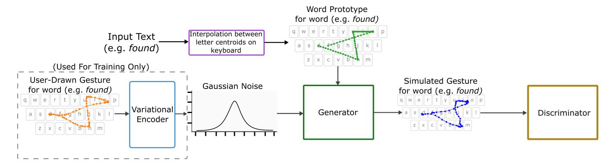

Figure 2: A depiction of the WordGesture-GAN architecture. The word prototype (straight lines connecting letter centroids on a keyboard) and a random Gaussian latent code are inputs to the generator. The output of the generator is then fed to the discriminator and the discriminator outputs how realistic the gesture is. The variational encoder generates the Gaussian latent code for training the generator only. User-drawn gestures (orange) are not involved when we use the generator to simulate gestures.

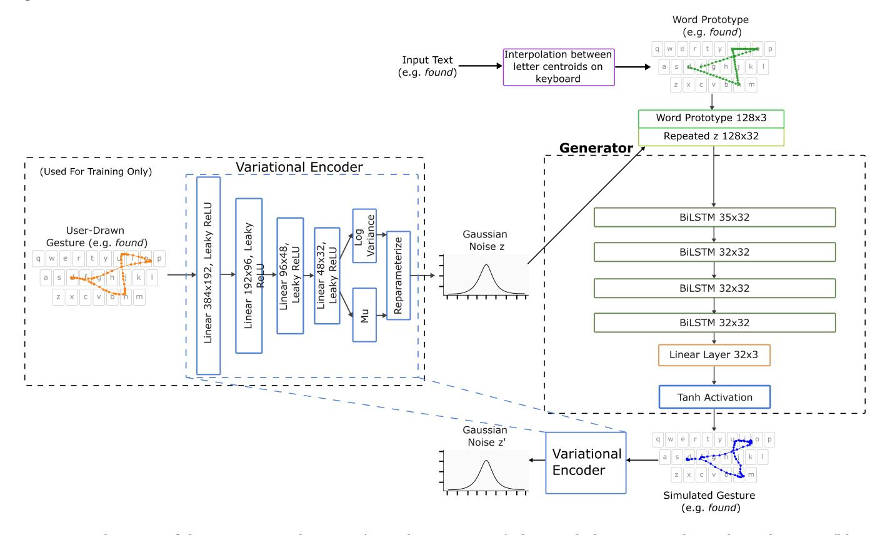

Figure 3: A depiction of the Generator architecture (green box in Figure [2\)](#page-4-0) along with the Variational Encoder architecture (blue box in Figure [2\)](#page-4-0). The word prototype (green) acts as the conditional input for the generator. During training, the variational encoder encodes user-drawn gestures (orange) into the Gaussian latent space. The resulting latent code is repeated along the length of the prototype shape and is concatenated before being fed into the Generator. To ensure the Generator uses the latent code in a meaningful way, we recover the latent code from the simulated gesture using the variational encoder and compare it against the original latent code

We normalized the coordinates of both user-draw gestures and word prototypes. More specifically, the x and y coordinates of both user-drawn gestures and word prototypes are normalized to be within [-1,1] where -1 is the left/top of the keyboard and 1 is the right/bottom of the keyboard. The unit of timestamps are in seconds to ensure the scale of timestamp values is similar to the scale of coordinates. The output of the generator is a simulated gesture for a word, which is then passed to the discriminator.

#### 3.1.2. Structure.

The generator is a multi-layer Bidirectional LSTM that takes both the prototype shape and the latent code as input. The LSTM is designed to model data in a sequential manner, which makes it appropriate for generating word-gestures. To provide the latent code to the generator it is first repeated along the sequence length and then concatenated with the prototype shape (as shown in Figure 3). This method of concatenation follows the method proposed in Bicycle GAN to input a latent code alongside a semantic map[50].

We use a Variational Encoder to encode a user-drawn gesture into a Gaussian latent code (Figure 3). The encoder is a multi-layer perceptron with two final layers to get the mean and variance representing aspects of the gesture. With these two parameters encoded from the gesture, we can then use the reparamaterization trick as described in the original Variational Auto-Encoder (VAE) paper [20] to sample from a Gaussian distribution in a way that is differentiable for training. By training the network in this way, we ensure that the Gaussian noise will have some meaningful structure for generation.

### 3.2. Discriminator

#### 3.2.1. Input and output.

The discriminator takes either simulated gestures from the generator or user-draw gestures as input and outputs to what degree the input gesture is a user-drawn gesture. Despite the generator being conditional, we avoid using a conditional discriminator as in practice we found that the model performs better when trained with an unconditional discriminator. This is consistent with the findings of previous works[36, 50].

The output of the discriminator D(x) for a gesture x describes how much the discriminator believes the gesture x is user-drawn. a smaller number (e.g. D(x) < 0) means the gesture is simulated, while a larger number (e.g. D(x) > 0) means it is user-drawn.

The output of the discriminator on the user-drawn and simulated gestures, along with an additional reconstruction loss for the generator, are then used in back propagation to adjust the weights of the full WordGesture-GAN, including both the generator and discriminator following their respective loss functions.

#### 3.2.2. Structure.

The discriminator adopts a multi-layer perception structure to output a single value representing how realistic the output is. The discriminator takes only the user-drawn or simulated gesture as input. A depiction of the discriminator for this model is given in Figure 4.

### 3.3. Loss functions

#### 3.3.1. Loss function for discriminator.

We use the Wasserstein GAN loss [3] as the loss function for the discriminator. The objective of the discriminator is to minimize the loss function over all words in

the training dataset. The loss function for a word y under a particular generator (G) and a discriminator (D) is denoted by  $L_{disc}(y)$ , and is defined as:

$$L_{disc}(y) = \mathbb{E}_{z \sim P(z)} [D(G(z, y))] - \mathbb{E}_{x \sim P(x)} [D(x)]$$
 (1)

The term z is a sample from the latent space representing the variation of user-drawn gestures (Figure 3), which has a Gaussian distribution denoted by P(z). G(z,y) is a gesture simulated by Generator G for the word y with the sampled variation z. The term D(G(z,y)) is the output (a real number) from discriminator D which describes how close the simulated gesture G(z,y) is to a user-drawn gesture.  $\mathbb{E}_{z\sim P(z)}[D(G(z,y))]$  is the expectation of D(G(z,y)) over a distribution of P(z). The term x represents a user-drawn gesture, which has a distribution of P(x). D(x) represents the output of the discriminator which describes how close x is to a user-drawn gesture.

Minimizing the loss function over all words maximizes the output of discriminator for user-drawn gestures, while minimizing the output of the discriminator for simulated gestures. The loss function output acts as an estimate of the Wasserstein distance between the user-drawn and simulated gestures, providing a strong gradient for training.

#### 3.3.2. Loss function for generator.

The loss function of the generator for a word y is denoted by  $L_{gen}(y)$ , and is defined as follows.

$$L_{gen}(y) = -L_{disc}(y) + \lambda_{feat}L_{feat}(y) + \lambda_{rec}L_{rec}(y) + \lambda_{lat}L_{lat}(y) + \lambda_{KLD}L_{KLD}$$
(2)

It is a weighted average over 5 components. The weights  $\lambda_{feat}$ ,  $\lambda_{rec}$ ,  $\lambda_{lat}$ , and  $\lambda_{KLD}$  are hyper-parameters. We present their actual values in Section 4.2. The definition of each of the five components is explained as follows.

- The term Ldisc(y) is the loss function of the discriminator (Equation 1).
- The term  $L_{feat}(y)$  is the feature matching loss for a given word y, which measures the difference between the statistics

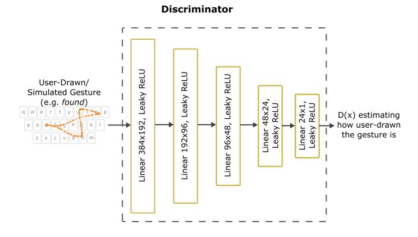

Figure 4: A depiction of the Discriminator architecture (brown box in Figure 2). The input is either a user-drawn gesture or a simulated gesture. The output is a single value representing how realistic the gesture is, where a larger value (e.g. D(x)>0) means it is user-drawn.

of user-drawn (x) and generated gestures (G(z, y)) for all hidden layers of the discriminator. The method used is the same as in the Pix2PixHD paper [45] and is defined as

$$L_{feat}(y) = \mathbb{E}_{z \sim P(z), x \sim P(x)} \sum_{i=1}^{T} \frac{1}{N_i} (||D^{(i)}(G(z, y)) - D^{(i)}(x)||_1)$$
(3)

Where T is the total number of hidden layers in the discriminator,  $D^{(i)}$  is the i-th layer of the discriminator,  $N_i$  is the number of elements in layer i.

- The term  $L_{rec}(y)$  represents the reconstruction loss for a word y, which is the  $L_1$  loss between user-drawn gestures x, and simulated gestures from Generator G(z,y). It is defined as

$$L_{rec}(y) = \mathbb{E}_{p \sim P(x), q \sim G(z, y)} |p - q| \tag{4}$$

The  $L_1$  distance p-q is calculated between the *i*th point of the gestures as:

$$|p - q| = \sum_{i \in n} |x_{p_i} - x_{q_i}| + |y_{p_i} - y_{q_i}| + |t_{p_i} - t_{q_i}|$$
 (5)

where  $p_i$  and  $q_i$  is the ith point of the user-drawn gesture p and a simulated gesture q, (x, y) are coordinates and t is the timestamp.

- To enforce greater diversity in outputs and prevent mode collapse, we include a latent encoding loss  $L_{lat}$  like the one found in Bicycle GAN [50]. We take a randomly sampled encoding z from the Gaussian distribution P(z) and attempt to recover it using  $\tilde{z} = E(G(z,y))$ . we compare the original latent code z and the recovered latent code  $\tilde{z}$  using the  $L_1$  distance. This loss is defined as

$$L_{lat}(y) = \mathbb{E}_{z \sim P(z)}[||E(G(z, y)) - z||_1]$$
 (6)

While the reconstruction loss from Equation 5 enforces that simulated gestures  $\tilde{x}$  generated from latent codes are consistent with user-drawn gestures x, the latent encoding loss ensures that encodings resulting from simulated gestures  $\tilde{z}$  are consistent with the initial encoding z.

- We also include  $L_{KLD}$  as a part of the loss function, which is the Kullback-Liebler Divergence (KLD) [24] between the variational encoder outputs and a normal distribution. This term as mentioned briefly in section 3 ensures that the distribution of the variational encoder output does not diverge too far from the Normal distribution and therefore become difficult to sample from.

The objective of the generator is to minimize the loss function (Equation 2) over all words in the training data set. Minimizing the loss function would maximize the term  $\mathbb{E}_{z\sim P(z)}\left[D(G(z,y))\right]$  which indicates how likely a simulated gesture will be recognized as a user-drawn gesture by the discriminator. Conversely, by minimizing the loss function the  $L_{feat}$ ,  $L_{rec}$ ,  $L_{lat}$ , and  $L_{KLD}$  losses end up being minimized.

## 4. TRAINING WordGesture-GAN

### 4.1. Dataset

We used the publicly available mobile word-gesture dataset [26] with 38k gestures for training and testing. The dataset was collected

via a web-based custom virtual keyboard, involving 1,338 users who submitted word-gestures for 11,318 unique English words. The original dataset consisted of around 124k gestures. We removed gestures marked as invalid and gestures for single letter words. The original dataset was heavily imbalanced, with certain words like "the" getting significantly more representation in the dataset than other words. To avoid bias for certain words introduced by imbalanced training data, for any word with more samples than some upper bound n, we sampled n gestures for that word randomly from the dataset and discarded the rest. After setting the upper bound as n = 5, we ended up with a dataset of around 38k gestures, spread across approximately 11k words.

We split the dataset into a training and testing set each with a unique set of words. To ensure no words overlap, we first randomly split the words into training and testing words following the split ratio. We used a ratio of 80% training 20% testing to split our data, resulting in 9045 unique training words and 2262 unique testing words. We then sort the gestures into the relevant set based on the word each gesture represents. The final training set size is 30k unique word-gestures (only for training) while the final testing set size is 7.6k unique word-gestures (exclusively held out for testing).

### 4.2. Training Process

We followed the procedure for training Wasserstein GAN [3] to train WordGesture-GAN. We updated the discriminator 5 times for every 1 update to the generator. This ensured that the discriminator trained to optimality and provided a strong gradient for the generator to follow. For the Gaussian latent code, we used a 32-dimensional vector as input to the network. For the weights of the components of the generator loss, we use  $\lambda_{feat}=1$ ,  $\lambda_{rec}=5$ ,  $\lambda_{lat}=0.5$ , and  $\lambda_{KLD}=0.05$ . We used a batch size of 512 and a learning rate of 0.0002 on the ADAM optimizer. Leaky ReLU was used between all layers of both the discriminator and the encoder, while the Tanh activation found within the LSTM layer itself was used as activation for all layers of the generator. Spectral normalization [34] is used on all layers of the discriminator, due to the K-Lipschitz constraint for the WGAN loss.

We also trained the network in two cycles similar to how it is done in Bicycle GAN [50]. In one cycle, the model is given a randomly sampled latent code z to generate a new gesture X' and must recover the latent code (denoted as z') from the simulated gesture X' using the variational encoder  $(z \to X' \to z')$ . The latent codes z and z' are then compared using the latent code loss defined in Equation 6. In the second cycle a user-drawn gesture X was encoded by the variational encoder to a latent code z' and was used as input to the generator to generate a new gesture X' $(X \rightarrow z \rightarrow X')$ . The user-drawn gesture X and the simulated gesture X' are then compared using an  $L_1$  reconstruction loss as described in Equation 4. For each cycle a separate discriminator is trained, both having the same structure. As with the original Bicycle GAN paper [50] we found that this improved the outputs of the model. For the  $z \to X' \to z'$  cycle we also freeze the encoder when updating the latent code reconstruction loss to prevent the encoder from hiding information from the generator.

## 5. EVALUATION

We used an ensemble of methods and measures to evaluate WG-GAN generated word-gestures. Each method looked at a different aspect of these gestures in comparison to those generated by the prior state-of-the-art word-gesture models.

### 5.1. Re-implementing Minimum Jerk Model and Style-Transfer GAN

As a baseline for comparison, we first implemented the minimum jerk model following Quinn and Zhai's work [37]. We trained the model as explained in [37] to find the aggregate distribution of the offsets from the key centers, and to find the mean and standard deviation of the angles between the next key center and the midpoint on the gesture curve about the previous character point. After training on the same training dataset, we used the model to generate the same number of simulated gestures as the testing dataset.

We also implemented the Style-Transfer GAN with explicit style transfer [31, 32] as another baseline for comparison. We constructed a sequence to sequence (Seq2Seq) model [42] as the generator for the network. We replaced the original Minimax GAN loss with the Wasserstein GAN loss for ease of training, given that this is a smaller dataset than the original paper [31]. Since the original paper did not specify how the style encodings were added in to the Generator network, we chose to concatenate them together in the encoding layer of the Seq2Seq model, as concatenation is a common way to combined two inputs into one. The original Style-Transfer GAN simulate only spatial movement for gestures (i.e., a sequence of  $(x_i, y_i)$ ). We extended it to generate both spatial and temporal movements (i.e., a sequence of  $(x_i, y_i, t_i)$ ), to make it comparable to the gestures generated by WordGesture-GAN. We achieved this by representing a gesture with a vector of  $(x_i, y_i, t_i)$ , instead of  $(x_i, y_i)$ , in training. After training on the same training dataset, we sampled gestures to get the same number of simulated gestures as the testing dataset.

### 5.2. Simulating gestures with the generator in WordGesture-GAN

After training WordGesture-GAN, we used the generator to simulate gestures, and evaluated them on the held-out testing dataset. To simulate gestures for an arbitrary word W, we represented W as a word prototype and fed it into the generator. The generator then sampled a Gaussian latent code (Figure 3) to control the variation of the simulated gestures. With these two inputs (prototype shape, Gaussian latent code), the generator was able to simulate gestures for W. We simulated gestures for every word within the testing dataset. The number of simulated gestures for a word W was identical with the number of user-drawn gestures for W in the testing dataset. Therefore, the simulated gesture dataset was exactly the same size as the testing dataset. Recall that the words in the testing dataset do not overlap with words used in training.

When generating gestures, the only input to the generators for all the three models (the Minimum Jerk, Style-Transfer GAN, and WordGesture-GAN) was the input text. None of them took userdrawn gestures as references. Such a setup tested the capability of a generator for generating realistic gestures for arbitrary text. Taking the input text as the only input also made the comparison fair across models.

### 5.3. Visual Inspection

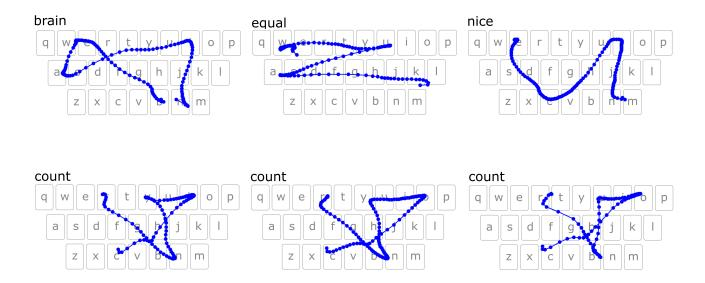

Figure 5: Top: Examples of simulated gestures by WordGesture-GAN for three different words. The dots shown are evenly spaced in time, so areas where the dots become denser are areas where the gesture speed slows down. Bottom: Three simulated gestures from WordGesture-GAN for the word "count". All these words were unseen in the training dataset.

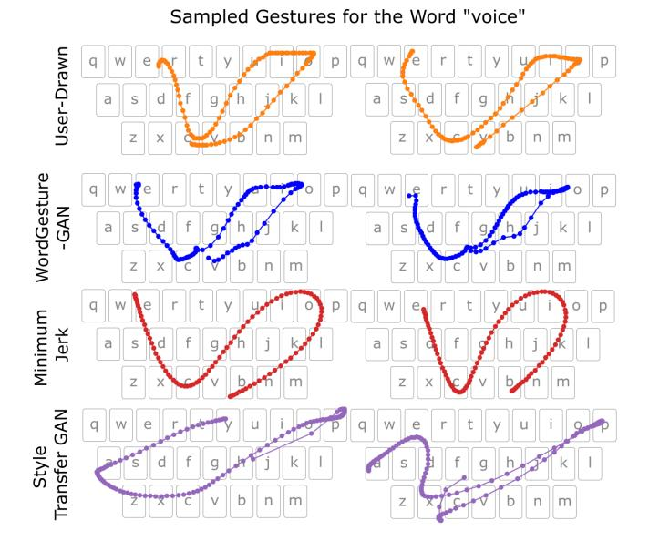

Figure 6: Examples of user-drawn and simulated gestures from all three models for the word "voice". The dots shown are evenly spaced in time, so areas where the dots become denser are areas where the gesture speed slows down. All three models took the text "voice" as the only input.

We first visually inspected the simulated gestures from the three models, to qualitatively evaluate whether they resembled user-drawn gestures. Figures 5, 6, 7, and 8 show examples of simulated gestures by different models in comparison with user-drawn gestures. As shown in Figure 5, the simulated gestures by WordGesture-GAN (blue curves) to a large degree matched our expectation of

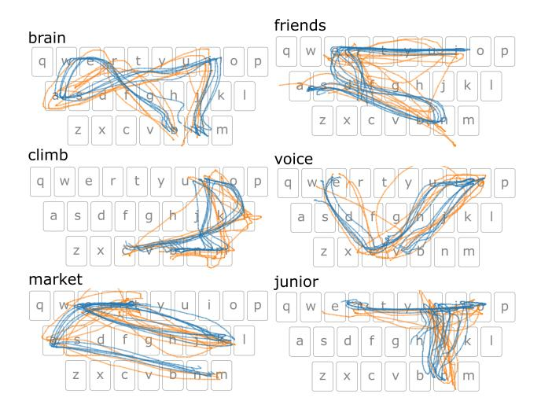

Figure 7: Five simulated gestures (blue) by WordGesture-GAN overlaying five user-drawn gestures (orange) for the same word.

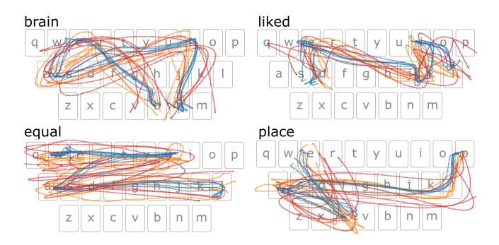

Figure 8: Comparisons of WordGesture-GAN simulated gestures dynamics (blue) to user-drawn gesture dynamics (orange) and Minimum Jerk model simulated gestures (red) for the same word.

how users would draw gestures. The generated gestures by the Minimum Jerk model [37] (red curves in Figure 5) showed smoothness along the movements. It is expected as the gestures generated by this model should minimize the changes in acceleration along the path. The shapes of gestures generated by the Style-Transfer GAN (purple curves in Figure 5) deviate from the user-drawn gestures. It was probably because the style-transfer GAN was originally designed to work with user reference input [31, 32], but in our test user-drawn gestures (reference gestures) were absent in gesture generation. One possible reason for the sub-optimal performance of Style-Transfer GAN is that style-encoder in this model did not have a well-defined shape to describe the latent space where the style of drawing was embedded. It made the style sampling uncertain thus resulting in unrealistic movements when the user reference gestures were absent.

### 5.4. Wasserstein Distance between Simulated and User-drawn Gestures

To understand to what degree the simulated gestures mimic the user-drawn gestures, we examined the *Wasserstein distance* between the simulated gestures and the user-drawn gestures using both  $L_2$ and dynamic time warping (DTW) distance as distance metrics. We calculated the Wasserstein distance for each distance metric within the words as follows. For a word *W*, we first calculated the  $L_2$  (or DTW) distance between each simulated gesture and user-drawn gestures for the given word *W*. For measuring the  $L_2$ distance between gestures we maintain the temporal order of the gesture, where the *i*-th point of the generated gesture is measured against the *i*-th point of the user-drawn gesture. We then formulate the problem of calculating the Wasserstein distance as a minimum weight matching on a bipartite graph between simulated gestures and user-drawn gestures, where the weights of the edges were the  $L_2$  (or DTW) distances calculated beforehand (distances between gestures for different words are set to infinity). After performing the minimum weight matching, the mean of the weights of all remaining edges is the average minimum  $L_2$  (DTW) distance, which represents the smallest average cost needed to convert a simulated gesture to a user-drawn gesture for a word. This is equivalent to calculating the Wasserstein Distance, using  $L_2$  (DTW) distance as the metric.

Tables 1 and 2 show the Wasserstein distance for the  $L_2$  and DTW distance metrics between simulated and user-drawn gestures for the WordGesture-GAN, Style Transfer GAN, and minimum jerk models. Note that as the minimum jerk model does not simulate non-relative timestamps for touch points, we only have the Wasserstein distance for  $(x_i, y_i)$  sequences for this model. As shown, WordGesture-GAN yields a smaller Wasserstein distance than the minimum jerk model and Style-Transfer GAN, indicating that the gestures simulated by WordGesture-GAN are more similar to the user-drawn gestures compared with the other two models. Figure 8 shows examples of simulated gestures of WordGesture-GAN and the Minimum Jerk model compared with the user-drawn gestures. As shown, WordGesture-GAN could simulate gestures similar to the user drawn-gestures.

### 5.5. Frechet Inception Distance Score between Simulated and User-drawn Gestures

We also measured the realism and diversity of generated gestures using the Frechet inception distance score (FID) [16]. In image generation tasks, the FID score is a common metric for evaluating both the realism and diversity of images and has been shown to correlate well with human perception of realism [16]. To apply this metric to our work, we trained an auto-encoder on the training dataset we used for the other 3 models. The objective of the auto-encoder was to encode a user-drawn gesture to a reduced dimension latent code and use the resulting latent code to reconstruct the original gesture. The auto encoder is a different structure from the GAN model, consisting of a multi-layer perceptron encoder and a multi-layer perceptron decoder, and being tasked with reconstructing the original gesture that was given. After extracting latent codes for both user-drawn gestures and simulated gesture using the encoder, we measured the Frechet Distance [16] between the user-drawn

| Method             | L2 Wasserstein Distance for $(x_i, y_i)$ sequences | L2 Wasserstein Distance for $(x_i, y_i, t_i)$ sequences |
|--------------------|----------------------------------------------------|---------------------------------------------------------|
| Minimum Jerk Model | 5.004 (2.099)                                      | -                                                       |
| Style Transfer GAN | 10.4805 (2.011)                                    | 10.4891 (2.011)                                         |
| WordGesture-GAN    | 4.409 (2.193)                                      | 4.426 (2.198)                                           |

Table 1: Mean (std. dev) of  $L_2$  Word Wasserstein Distance between simulated gestures and user-drawn gestures on the testing dataset. The minimum jerk model is evaluated for  $(x_i, y_i)$  sequences only as it does not predict the timestamps of touchpoints on a non-relative timescale. As shown, WordGesture-GAN has better generation accuracy than the Minimum Jerk model and Style Transfer GAN (lower is better).

| Method             | DTW Wasserstein Distance for $(x_i, y_i)$ sequences | DTW Wasserstein Distance for $(x_i, y_i, t_i)$ sequences |
|--------------------|-----------------------------------------------------|----------------------------------------------------------|
| Minimum Jerk Model | 2.752 (1.488)                                       | -                                                        |
| Style Transfer GAN | 8.11 (1.943)                                        | 8.132 (1.941)                                            |
| WordGesture-GAN    | 2.146 (1.592)                                       | 2.183 (1.598)                                            |

Table 2: Mean (std. dev) of Dynamic time warping (DTW) Word Wasserstein Distance between simulated gestures and user-drawn gestures on the testing dataset. The minimum jerk model is evaluated for  $(x_i, y_i)$  sequences only as it does not predict the timestamps of touchpoints on a non-relative timescale.

and generated gesture latent code distributions using the mean and variance from each. For simulated gestures that are similar to user-drawn gestures, their encodings in the latent space should be similar to the encodings of user-drawn gestures, resulting in a small Frechet distance in the latent space. The final  $L_1$  reconstruction loss in training was 0.041 and the final  $L_1$  reconstruction loss on the testing set was 0.046. The FID Scores are presented in Table 3. As shown, the distribution of gestures generated by WordGesture-GAN have the lowest Frechet Distance, indicating that they resembled the user-drawn gestures more closely than gestures generated by the other two models.

| Method             | Frechet Inception Distance Score |
|--------------------|----------------------------------|
| Minimum Jerk Model | 0.354                            |
| Style Transfer GAN | 2.733                            |
| WordGesture-GAN    | 0.270                            |

Table 3: Frechet Inception Distance between generated and user-drawn gestures by three models. Lower score is better.

### 5.6. Precision and Recall of Generated Gestures over the User-Drawn Gestures

To further assess the realism and diversity of generated gestures, we use precision and recall [25] to assess whether generated gestures truthfully represent the user-drawn gestures (precision), and whether the generated gestures cover variance in the user-drawn gestures (recall). Specifically, we followed a previously proposed method to estimate the manifold for the user drawn and generated gestures using k nearest neighbors[25]. For estimating the precision and recall for the user-drawn distribution U and the generated distribution G, we describe the precision as the percentage of generated gestures in G that fall within the the user-drawn gesture manifold, while recall represents the percentage of user-drawn gestures that fall within the generated gesture manifold.

More specifically, we calculated the precision and recall as follows. We first estimated the respective gesture manifolds by taking each gesture from the respective distribution  $(U_i \text{ or } G_j)$  and drawing a bounding circle B(p,r) around each gesture, where p is the center point, represented as a gesture, and r is the radius of the bounding circle. For estimating the manifold, r is equal to the distance to the k-th nearest neighbor of center point p represented as  $NND_k(p)$ . We set k=3 as suggested in the original paper[25]. The distance between gesture pairs is calculated using the  $L_2$  distance the same way as the  $L_2$  distances were calculated for the  $L_2$  Wasserstein distance.

With the manifolds defined, we estimate the precision and recall as follows:

$$precision = \frac{1}{|U|} \sum_{j=0}^{|U|} 1_{\exists i \text{ s.t. } G_j \in B(U_i, NND_k(U_i))}$$
(7)

$$recall = \frac{1}{|G|} \sum_{i=0}^{|G|} 1_{\exists i \text{ s.t. } U_i \in B(G_j, NND_k(G_j))}$$
(8)

The precision and recall for all three models on the testing dataset are presented in Table 4. The results show that WordGesture-GAN has the highest precision value, indicating that WordGesture-GAN outperformed other two models in generating realistic gestures. On the other hand, The recall score of WordGesture-GAN is lower than other models, indicating that it could be further improved by increasing the variance of generated gestures. We discuss a potential research direction to mitigate this issue in the Limitations and Future Work section.

| Method             | Precision | Recall |
|--------------------|-----------|--------|
| Minimum Jerk Model | 0.785     | 0.575  |
| Style Transfer GAN | 0.229     | 0.569  |
| WordGesture-GAN    | 0.973     | 0.258  |

Table 4: Precision and recall of generated gestures over the user-drawn gestures for all three models. Higher is better.

### 5.7. Correlations for Velocity and Acceleration between Generated and User-drawn Gestures

In addition to visual analysis, we also analyze the correlation for the Velocity and Acceleration between generated and user-drawn gestures, following the method used to evaluate the Minimum Jerk Model [\[37\]](#page-13-0). We measured the Pearson Correlation between the user-drawn and generated gestures to quantify the correlation between the profiles. Our analysis presented in Table [5](#page-11-0) shows that although the correlation for WordGesture-GAN is not the highest for either velocity or acceleration, it is close to the highest value for both measures. More specifically, WordGesture-GAN is slightly behind the Minimum Jerk Model, but better than the Style-Transfer Model in velocity correlation; it is slightly behind Style-Transfer GAN model, but better than the Minimum Jerk model in acceleration correlation.

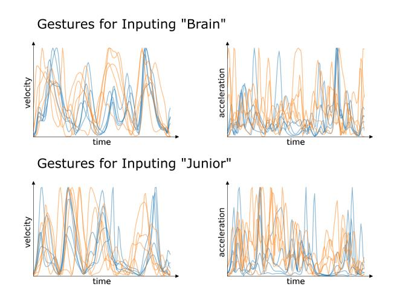

Figure 9: Comparisons of five simulated gestures dynamics by WordGesture-GAN (blue) to five user-drawn gesture dynamics (orange) for the same word. Simulated gestures were able to reflect the trends of movement dynamics in user-drawn gestures.

### 5.8. Distributions of Velocity and Acceleration for Generated and User-Drawn Gestures

We also compare the distributions of velocity and acceleration for generated and user drawn gestures against each other using box plots. We calculate the velocities and accelerations across all gestures by using first and second derivative Savitzky-Golay filters [\[40\]](#page-14-14) and applying them to the gestures. Figure [10](#page-10-0) shows the distributions of velocity and acceleration for the user-drawn gestures and generated gestures from all 3 models. The distributions are visualized using a box plot. The distributions of velocities and accelerations for WordGesture-GAN more closely represent the distributions of velocities and accelerations for the user-drawn gestures than the other two models.

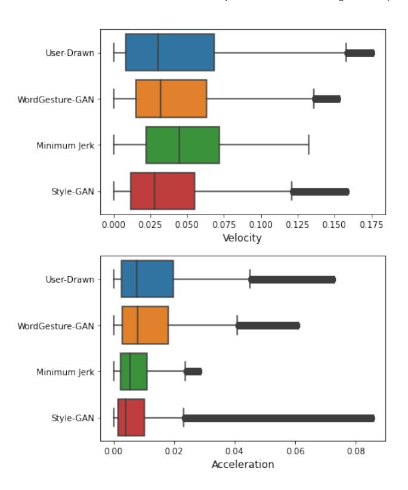

Figure 10: Box plots showing the velocity and acceleration distributions normalized by the keyboard dimensions for the user-drawn gestures and generated gestures for all 3 models. The distributions for WordGesture-GAN are closer than both the Minimum Jerk and Style-GAN models to the user-drawn distributions.

### 5.9. Comparing Jerk in User-drawn and Generated Gestures

We compared the average jerk of user-drawn and generated gestures for each model as well. If the generated gestures resemble the user-drawn gestures, they should have the similar amount of jerk. We calculated the jerk by applying a third derivative Savitzky-Golay filter [\[40\]](#page-14-14) to the gestures, using a third degree polynomial and a window size of 5. Table [6](#page-11-1) shows the mean (std. dev) of jerk over all generated and user-drawn gestures. As shown, the amount of jerk in gestures generated by WordGesture-GAN is closest to the amount of the jerk in the user-drawn gestures, indicating that the gestures generated by WordGesture-GAN resemble the user-drawn gestures more closely than other two models. It is also as expected that the gestures generated by the minimum jerk model have the lowest jerk as this model aims to the minimize the jerk of gesture movements.

### 5.10. Duration of Gesture Production

As WordGesture-GAN can simulate the timestamps of each touch point, it can predict the duration of drawing a gesture: the timestamp of the last touch point also indicates the duration of the drawing a gesture. To understand whether this duration prediction is

| Method             | Velocity Correlation | Acceleration Correlation |
|--------------------|----------------------|--------------------------|
| Minimum Jerk Model | 0.40 (0.24)          | 0.21 (0.14)              |
| Style Transfer GAN | 0.31 (0.18)          | 0.26 (0.21)              |
| WordGesture-GAN    | 0.40 (0.21)          | 0.26 (0.17)              |

Table 5: Mean (std. dev) of Velocity and acceleration correlations between simulated and user drawn gestures for each model.

| Method             | Jerk                   |
|--------------------|------------------------|
| User-Drawn         | 0.0066 (0.0103)        |
| Minimum Jerk Model | 0.0034 (0.0098)        |
| Style Transfer GAN | 0.0051 (0.0107)        |
| WordGesture-GAN    | **0.0058** (0.0083) |

Table 6: mean (std. dev) jerk for gestures from the presented models and user-drawn gestures.

accurate, we compared WordGesture-GAN against the CLC model [6] for predicting the duration of drawing gestures. The CLC model approximates the gesture production duration by summing up the cost for drawing line segments of a word prototype. More specifically the time duration for drawing line segments is determined by a function with parameters m and n

$$T(\overline{AB}) = m * (||\overline{AB}||_2)^n \tag{9}$$

where  $\overline{AB}$  is a line segment,  $||\overline{AB}||_2$  is the length of the line segment, and m and n are empirically determined constants. The equation to get the duration of a gesture for a word is then the sum of the duration of the line segments. the final equation for the duration of a word is then

$$T(P) = \sum_{\overline{AB} \in P} T(\overline{AB}) \tag{10}$$

We optimized the m and n values on the training set by finding the combination of m and n that minimizes the Root Mean Square Error (RMSE) of the total duration. The values were m = 431.9 and n = 0.125.

The evaluation on the testing dataset showed that the RMSE for the CLC model was 1150.7 ms while WordGesture-GAN achieved an RMSE of 1180.3 ms. For reference, the average duration of gestures in the testing dataset was 1946.8 ms. Both WordGesture-GAN and the CLC model have similar performance in predicting the mean of duration. Our further analysis showed that WordGesture-GAN is better at estimating the duration of longer gestures, while the CLC model is better for short-length words, as is shown in Figure 11. Different from the CLC model, since WordGesture-GAN generates a distribution, it can estimate the variance of durations for gesture movement time. It estimated that the mean of Std. Dev. of gesture duration per word is 140 ms. For reference, the mean Std. Dev. of duration of user-drawn gestures per word was 609 ms.

## 6. DISCUSSION AND FUTURE WORK

### 6.1. Performance of WordGesture-GAN

Our experiment results on the testing data set showed that the gestures generated by WordGesture-GAN more closely resemble the user drawn gestures than the Minimum Jerk model [37] and

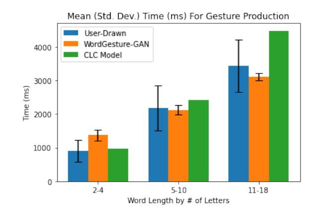

Figure 11: Mean (Std. Dev) gesture duration for words with different lengths for User-Drawn, and prediction by WordGesture-GAN and the CLC model. The mean and standard deviation duration for each word are calculated and then averaged within the respective word length bucket for user-drawn and prediction by WordGesture-GAN. The CLC model does not have error bars since it only estimates a single mean value for each word and cannot predict the standard deviation of gesture duration

Style-Transfer GAN [31, 32]. The  $L_2$  and DTW Wasserstein distances between the simulated and user-drawn gestures show that WordGesture-GAN captures the shape of user-drawn gestures the best, compared with the Minimum Jerk and Style-Transfer GAN. Our analysis of the total amount of jerk, and FID score also shows the gestures generated by WordGesture-GAN resemble the user-drawn gestures more closely than other two models. We also presented visual examples of user-drawn gestures and simulated gestures from all 3 models to show that WordGesture-GAN has the closest resemblance visually to user-drawn gestures.

### 6.2. Applications of WordGesture-GAN

Generative gesture models like WordGesture-GAN can be used to improve the development and evaluation of word-gesture based input systems, and for keyboard layout optimization and evaluation.

First, as simulated gestures can accurately reflect spatial and temporal features of gesture movements, WordGesture-GAN can be used for training and testing a word-gesture decoder. The development of word-gesture based input systems often require a large number of gestures for training and testing, which is laborious to collect. WordGesture-GAN can be deployed to simulate a large number of gestures for words with only small training samples, and for words that were not included in data collection. Its ability

| Training Setup                            | Word error rate on testing data set |
|-------------------------------------------|-------------------------------------|
| 200 User-drawn gestures                   | 32.8%                               |
| 200 User-drawn + 10000 simulated gestures | 28.6%                               |
| 10000 Simulated gestures                  | 28.6%                               |
| 10000 User-drawn gestures                 | 27.8%                               |

Table 7: Word error rate of the SHARK2 decoder for different training setups

to simulate both spatial and temporal sequences (i.e., $(x_i, y_i, t_i)$) is valuable especially if a decoder under evaluation takes into account both spatial and temporal information (e.g., speed or acceleration) for decoding.

As an example, we investigated using gestures simulated by WordGesture-GAN to train a SHARK2 decoder [22]. The SHARK2 decoder is a multi-channel recognition system that integrates distance scores from a location channel, a shape channel, and probability scores from a language component. The SHARK2 decoder algorithm assumes that the distance from a gesture to the standard template of the intended word (in either the shape or the location channel) follows a Gaussian distribution  $\mathcal{N}(0, \sigma)$ . First introduced in 2004 [22], SHARK2 outlines the principle of decoding gesture input that has been widely adopted by various gesture input systems (e.g., [10, 11, 23, 52]). It was also the algorithm adopted by the authors of the mobile word-gesture dataset [26] to analyze the gesture input accuracy. We decided on the SHARK2 decoder due to it being a well-known and accessible open-source algorithm. Our results shown here using the decoder can therefore be used for comparison against other works. For the shape channel, this distribution is  $\mathcal{N}(0, \sigma_{Shape})$ , and for the location channel, this distribution is  $\mathcal{N}(0, \sigma_{Loc})$ . Therefore, there are three main empirically determined parameters in the SHARK2 decoder:  $\sigma_{Loc}$ ,  $\sigma_{Shape}$ , and  $\sigma_{LM}$  which is the weight for the language model as described in previous research [22]. We implemented a SHARK2 decoder following the description in the original paper [22], and trained the above three parameters using the setups described in Table 7 and tested the decoding results on 30000 unseen user-drawn gestures. We obtained user-drawn gestures from the mobile word-gesture dataset [26] for training and testing the SHARK2 decoder. More specifically, we reserved 30000 gestures for testing and randomly sampled 200 user-drawn gestures from the rest for training. We used the same 30k unigram language model trained from the COCA Corpus [12] across all conditions.

Our evaluation (Table 7) shows that augmenting user-drawn gestures with gestures simulated by WordGesture-GAN can benefit training word-gesture decoders. Furthermore, simulated gestures alone can achieve similar performance in training a word-gesture decoder compared to training with real-world gestures (decoding word error rate 28.6% versus 27.8%).

Second, since WordGesture-GAN can also predict the gesture production time for a word, it can serve as a performance model in interface design, optimization, and evaluation. For example, performance models such CLC model [6] and Rick's model [39] have been used to design, optimize, and evaluate keyboard layouts for word-gesture input. The WordGesture-GAN could play the same role as these models. A potential weakness of WordGesture-GAN is that neural network based model typically takes longer time than

an analytic model (e.g., CLC model [6]) for making prediction. More research is needed to understand whether it would be appropriate for keyboard layout optimization research.

Third, as a data-driven model, WordGesture-GAN can be trained to learn any type of word-gesture data. A key benefit of neural network based generative model is the ability to fine-tune them for specific tasks. As we have shown, our model is able to simulate a variety of word-gestures from a small training dataset, which is ideal for simulating difficult to sample data. For example, the model could be shown a dataset containing gestures where the user made a mistake and could learn to recreate those types of gestures for different words.

### 6.3. Limitations and Future Work

One area in which the current model can be improved further is the diversity of the generated gestures. While the model is capable of generate different gestures for a given word, the variance of these is somewhat limited compared to other gesture production models as is noted in Section 5.6. A potential method for improving the variance could be to use gestures generated by the Minimum jerk model as input instead of the straight-line prototype. Since the Minimum Jerk gestures already have some variance for a given word, this could improve the variance of gestures from the model while still maintaining higher fidelity.

## 7. CONCLUSION

We have designed and implemented WordGesture-GAN, a conditional generative adversarial network that takes arbitrary text as input, and generates realistic word-gesture movements in both spatial and temporal dimensions (i.e., a vector of  $(x_i, y_i, t_i)$ ). The innovations of WordGesture-GAN include introducing a Variational Auto-Encoder to extract the variation of user-drawn gestures, using the Wasserstein distance and  $L_1$  distance to ensure simulated gestures resembled user-drawn gestures, and adopting a two-cycle process to train the model. Our experiment on a 38k dataset shows that WordGesture-GAN outperforms the existing gesture production models [31, 32, 37] in generating realistic gestures, measured by the  $L_2$  and dynamic time warping Wasserstein distances, the Frechet Inception Distance (FID) scores, and the amount of jerk in gestures. WordGesture-GAN can also predict the duration of drawing word-gestures, serving as a performance model. Our evaluation shows it overall performs similarly to the existing CLC model [6] in predicting the duration of word-gesture movements. As WordGesture-GAN can generate realistic word-gestures and predict input performance, it serves as a valuable tool to develop and evaluate gestural input systems.

## REFERENCES

See [`references.md`](references.md).
