# Modeling Gesture-Typing Movements

Philip Quinn,<sup>1</sup> and Shumin Zhai<sup>1</sup> 1 Google Inc.

Word–Gesture keyboards allow users to enter text using continuous input strokes (also known as gesture typing or shape writing). We developed a production model of gesture typing input based on a human motor control theory of optimal control (specifically, modeling human drawing movements as a minimization of jerk—the third derivative of position). In contrast to existing models, which consider gestural input as a series of concatenated aiming movements and predict a user's time performance, this descriptive theory of human motor control predicts the shapes and trajectories that users will draw. The theory is supported by an analysis of user-produced gestures that found qualitative and quantitative agreement between the shapes users drew and the minimum jerk theory of motor control. Furthermore, by using a small number of statistical via-points whose distributions reflect the sensorimotor noise and speed–accuracy trade-off in gesture typing, we developed a model of gesture production that can predict realistic gesture trajectories for arbitrary text input tasks. The model accurately reflects features in the figural shapes and dynamics observed from users and can be used to improve the design and evaluation of gestural input systems.

Philip Quinn (philip@quinn.gen.nz) is a researcher with an interest in human factors measurement and modeling; he recently completed a doctorate at the University of Canterbury, New Zealand, and is presently a research scientist at Google Inc. Shumin Zhai (zhai@acm.org, shuminzhai.com) is an HCI scientist with an interest in foundational research and practical inventions of interaction methods; he is a senior staff research scientist at Google Inc.

Color versions of one or more of the figures in the article can be found online at [www.tandfonline.com/HHCI](http://www.tandfonline.com/HHCI).

## CONTENTS

- 1. INTRODUCTION
- 2. BACKGROUND
  - 2.1. Gestural Text Entry
  - 2.2. Human Motor Control
    - Motor Performance Models
    - Typing Performance Models
    - Gesture Performance Models
    - Movement Control Models
- 3. ROAD MAP
- 4. THE PROCESS OF GESTURE TYPING
  - 4.1. Initial Touch
  - 4.2. Movement Between Keys
  - 4.5. Lift & Commit
  - 4.6. Summary
- 5. A MINIMUM JERK ANALYSIS OF GESTURE TYPING
  - 5.1. Via-Point Identification
  - 5.2. Applying Minimum Jerk Theory
  - 5.3. Evaluating Minimum Jerk
    - Evaluation Metrics
    - Results
- 6. SIMULATING GESTURE MOVEMENTS
  - 6.1. Modeling the Distributions of Via-Points
    - Character Points
    - Movement Shape
  - 6.2. Generating Gesture Simulations
  - 6.3. Evaluating the Simulations
- 7. DISCUSSION
  - 7.1. Applications of the Model
  - 7.2. Improving the Model
  - 7.3. Alternative Motor Control Models
  - 7.4. Conclusions

## 1. INTRODUCTION

Gestural input allows information or commands to be issued to a user interface using a continuous input signal, rather than a series of discrete inputs (viz. tapping on buttons, keys, or menu items). The continuous input signal is decoded using a recognition system that judges the input's correspondence with a set of prototype signals and selects the closest prototype as the intended command (Zhai, Kristensson, Appert, Andersen, & Cao, [2011\)](#page-46-0). Gestural input increases the speed at which input can be provided by users because it relaxes precise aiming requirements, and in some cases can be scale and location independent. In particular, gesture-typing techniques—such as SHARK or shape writing—allow words to be entered via a text

<span id="page-2-0"></span>
FIGURE 1. Examples of a gesture prototype shape (dashed) alongside a user's gesture (solid).

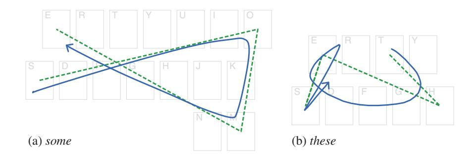

entry system by drawing a stroke over a conventional keyboard layout that approximately connects the letters of the desired word (e.g., Figure 1). These word–gesture techniques leverage a user's existing knowledge of a particular keyboard layout. Using robust recognition algorithms on a comprehensive lexicon, they have become a practical method for successful mobile text entry (Zhai & Kristensson, [2007](#page-46-0), [2012\)](#page-46-0).

Despite its practical success, research on human behavior and performance during gesture-typing tasks is limited. Understanding user interaction with gestural input is a complex topic as users have significant freedom in how they draw a gesture: They are not constrained to acquire a well-defined target but are aiming to reproduce a certain prototype shape. For example, Figure 1a shows an example of a user entering the word some with a gesture-typing interface: The dashed line shows the prototype for the word (a direct line between the center of each character's key), and the solid line shows the path drawn by the user. The user's path clearly resembles the prototype but is noticeably smoother and is offset. Existing models of user performance for gestural input have approached these paths as a series of aiming tasks (straight lines) connected by corners—that is, assuming a user's gesture will closely match the prototype shape, or that the underlying motor control process for drawing a gesture is analogous to that for serial aiming (e.g., Cao & Zhai, [2007;](#page-43-0) Rick, [2010\)](#page-45-0).

However, gestural input systems do not have explicit visual or target boundary constraints (a requirement of many aiming models), and their recognition algorithms are resilient to imprecision. Users of these systems want to produce gestures that are fast and easy to draw but are still correctly recognized by the system. To do this they adopt certain kinematic efficiencies (such as cutting corners; Pastel, [2006](#page-44-0)) to produce smooth figures that may deviate significantly from the prototype gesture but are still within the tolerances of the recognition algorithm. For example, Figure 1b shows a user's gesture for the word these against its prototype. Note how the gesture deviates from the prototype at several locations: cutting the corner at h, looping back on itself at the first e, and undershooting the terminal e. Such features are successfully resolved by the recognition algorithm but are beyond the scope of existing gesture performance models, which take the exact shape of a gesture to be a known quantity prior to production.

<span id="page-3-0"></span>
Human motor control during drawing tasks (e.g., tracing simple curves and handwriting) has been extensively studied in the motor control and neuroscience literatures. In particular, researchers have observed that human movement often appears to maximize smoothness: avoiding sharp corners or changes in direction that necessitate significant swings in acceleration. This propensity for smoothness can also be expressed as the minimization of some cost function: If certain actions are expensive for the human motor system to produce, then it seeks to produce movements that minimize them (Engelbrecht, [2001](#page-43-0)). The minimum jerk theory of motor control is one such approach that has significant empirical support (Flash & Hogan, [1985](#page-43-0)) and suggests that human movement can be described by trajectories that minimize the total amount of jerk (the third time derivative of position).

We demonstrate that the movements made during gesture production with computer interfaces—and, in particular, gesture typing on mobile devices—can be modeled by using the minimization of jerk as a key principle and constraint. Furthermore, we build a gesture production model by incorporating the stochastic properties and speed–accuracy trade-off found in these movements. Our model predicts a trajectory<sup>1</sup> from a minimal set of constraints (such as the word to be entered and the speed–accuracy trade-off strategy). The predicted trajectory (e.g., Figure 2) is a realistic simulation of what a user is likely to draw when presented with the same constraints (although it is not a prescription of the motor control process).

FIGURE 2. Examples of the gestures generated by the model—demonstrating the variety of forms it is able to produce, which are similar to those observed in human gestures.

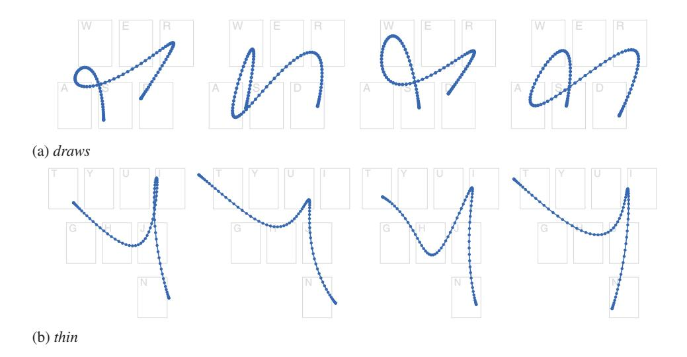

<sup>1</sup> In this article the term trajectory refers to all kinematic variables that describe some motion (position, velocity, acceleration, etc.), whereas the term path refers to only its geometric form.

After reviewing the related work (Section 2), we achieve this in three parts. First, to drive a motor control model we identify the via-points (Wada & Kawato, [1995\)](#page-46-0) of a gesture-typing task. These are analogous to targets in discrete aiming tasks and define the primary objectives and constraints of a user's actions. We identify possible points by deconstructing a gesture-typing task into its goals and task constraints. This provides a framework for understanding how users produce shapes that resemble the prototype for an intended word but do so in a smooth and kinematically efficient manner (Section 4).

Second, we adopt and validate a minimum jerk model for gesture typing by analyzing a large data set of user-produced gestures (Section 5). We reduce each gesture to its via-points and use a minimum jerk model of motor control across those points to reconstruct the original trajectory. We find a close correspondence between the empirical gestures drawn by users and the reconstructed gestures described by the minimum jerk model. These results offer an account for the how and why of the differences between prototype and gesture shape seen in [Figure 1](#page-2-0).

Third, we shift from analysis and validation to synthesis and generation, and examine the stochastic properties of the via-points to develop a gesture production model that simulates gestures for arbitrary words (Section 6). The simulations are generated by statistically sampling distributions of via-points modeled from a training set of gestures and applying the minimum jerk model across them. The simulated gestures are realistic predictions of the trajectories that users will produce, and accurately reflect their observed figural and dynamic properties (e.g., [Figure 2](#page-3-0)). This differs from existing models as it predicts a gesture shape—rather than time performance using a principled application of motor control theory. We conclude by discussing how this model can be used as an evaluation tool for gesture recognition algorithm efficacy, and as a design tool for optimizing gestural input methods (Section 7).

## 2. BACKGROUND

Interaction on mobile devices is challenged by the size of the device and the operating posture of the user—generally it is required that users are able to hold the device in one hand and supply input with a finger, thumb of the same or opposing hand, or pen/stylus device. For text entry, input is supplied through a touch or soft keyboard (a keyboard interface rendered and interacted with directly on a display) modeled on its physical counterpart in both visual appearance and interaction: a matrix of buttons representing the keys in a standard arrangement (e.g., QWERTY) that are tapped to enter their corresponding characters. However, the virtual nature of soft keyboards permits designers to investigate alternative layouts and interaction methods better suited to the constraints of mobile interaction.

This section reviews text entry methods that use gestures as their input: mapping shapes drawn by a user to the characters and words they want to enter (Section 2.1).<sup>2</sup> This

<sup>2</sup> General reviews of the issues for text entry interaction are also given by MacKenzie and Tanaka-Ishii ([2007\)](#page-44-0) and MacKenzie and Soukoreff ([2002\)](#page-44-0).

is followed by a review of research on human motor control relevant to understanding how users produce these gestures (their figural, kinematic, and dynamic characteristics) and models that describe their performance in doing so (Section 2.2).

### 2.1. Gestural Text Entry

With gesture-based text input, users draw shapes that are mapped to corresponding characters and words. The shape a user draws is matched against prototype shapes or descriptions by a recognition algorithm, with the closest<sup>3</sup> prototype identified as the intended character or word. This article is concerned with the shapes that users draw and not the specifics of the recognition algorithm (although the interaction between the recognition algorithm and a user's gesture is discussed). Zhai et al. ([2011](#page-46-0)) reviewed gesture interaction in general: the issues involved in designing gestures, their recognition systems, and evaluating them; here, we briefly review gestural text entry techniques, with a focus on the shapes users are expected to draw.

Early gestural text entry methods were designed around input at a character level: A unique gesture was assigned to each possible output character (letters, numbers, symbols, etc.). Unistrokes (Goldberg & Richardson, [1993\)](#page-43-0) is a vocabulary of gestures built from five basic stroke shapes—each in four orientations and two entry directions, for a total of 40 unique gestures. Goldberg (1993) attempted to create a figural association between each letter of the Latin alphabet and one of the abstract basic strokes—although this was not always possible (e.g., [Figure 3a](#page-3-0)). Although the gesture shapes were simple to draw, their abstract nature required users to memorize the associations between gesture and character, which were unlikely to be apparent.

Graffiti (U.S. Patent No. 6,493,464, [2002](#page-43-0)) also used a single stroke for each character but designed the gesture shapes from those of the corresponding characters (e.g., [Figure 3b\)](#page-3-0). These gestures were more complex than Unistrokes but reduced the training required for users who were already familiar with the Latin alphabet. Later versions of Graffiti (Jot and Graffiti 2) permitted multiple strokes to further improve the mapping for characters such as f, j, and x (Sears & Arora, [2002\)](#page-45-0).

The gestures of Unistrokes and Graffiti are visual-spatially independent (Zhai et al., [2011](#page-46-0)) as they do not require a visual interface to guide the user and can be performed at an arbitrary location and scale (where and at what size users draw the gesture is not relevant to its recognition or interpretation). However, the lack of visual guidance requires users to memorize the gesture set prior to use. The gestures are also restricted to individual characters and cannot be conjoined to form a word as a single stroke—users must disengage from the input surface to delimit each character and cannot develop a more cursive style.

Mankoff and Abowd [\(1998\)](#page-44-0) developed the Cirrin method to allow multiple characters to be entered in a single stroke. Cirrin displays characters in segments around a ring, and starting from the "neutral" center, a stroke is drawn that moves in and out of the segments to select their respective characters. Quikwriting (Perlin, [1998](#page-44-0))

<sup>3</sup> This article uses terms such as distance and closest as generic terms for the metrics of a gesture recognition algorithm and not to imply a specific matching method.

<span id="page-6-0"></span>
FIGURE 3. Examples of the strokes required to enter the word FORCE with (a) Unistrokes and (b) Graffiti. Note. Arrowheads indicate the direction of the stroke.

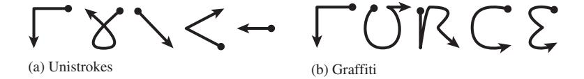

uses a more compact  $3 \times 3$  segment matrix that similarly discriminates among characters with strokes that are drawn through multiple segments.

Although complete words or phrases can be entered in a single stroke using Cirrin and Quikwriting, they necessitate a particular arrangement of characters to avoid ambiguity and careful control of the gesture being drawn to avoid accidental selection. These requirements result in long and complex gestures (featuring many changes in direction as a user moves between the characters of the word) and a strong *visual-spatial dependence* to guide the user while entering a word.

Zhai and Kristensson (2003) observed that for well-practiced words on soft keyboards users develop a memory for the pattern of movement between the keys. They designed the *SHARK* method to allow text entry by drawing these patterns directly: Users draw a path that approximately connects the keys of the characters in the word they want to enter (e.g., Figures 1 and 5). The path is normalized in scale and location and is matched against a lexicon of prototype shapes—with that of the shortest distance identified as the recognized word (and a pie menu to disambiguate between identical prototypes). Zhai and Kristensson found that these simple gestures (straight lines between keys) were highly memorable, and users could eventually produce them reliably without visual guidance (utilizing the location and scale independence).

SHARK<sup>2</sup> (Kristensson & Zhai, 2004) improved the recognition algorithm and removed the scale normalization and location independence—eliminating the need for a disambiguation pie menu and significantly increasing the size of the supported vocabulary. Variations of this technique have also been marketed as ShapeWriter or Gesture Typing.<sup>4</sup>

In contrast with character-based methods, gesture-typing techniques enter only complete words and can operate on an arbitrary keyboard layout—such as a familiar QWERTY layout or one optimized to minimize gesture distance (e.g., Rick, 2010; Smith, Bi, & Zhai, 2015; Zhai & Kristensson, 2003). Although matching against a lexicon of prototypes limits users to a finite set of words, it reduces the ambiguity in shape (a gesture is likely to pass over many keys that are not in the intended word) and allows users to deviate significantly from the ideal prototype to increase their input speed while retaining high recognition accuracy (Zhai & Kristensson, 2007). These properties have helped gesture typing become successful as a practical text entry method (Zhai & Kristensson, 2012).

<sup>4</sup> In the rest of this article the term *gesture typing* is used as a generic descriptor for the basic word-gesture keyboard input process.

### 2.2. Human Motor Control

Human motor control research aims to understand the organizing principles and processes behind people's movement actions. That is, when faced with a movement task (e.g., grasping an object, handwriting a word, or moving a computer mouse), how are the task constraints perceived, how are the actions to carry it out planned, and how is that plan executed successfully?

Most everyday motor control tasks are underconstrained: They can be completed with a large number of possible trajectories. Even in the seemingly trivial case of moving directly between two points (where the optimal path of movement is the straight line that connects them), the human motor system needs to resolve a complex set of dynamics that are controlled across that path (e.g., torque to the joints of the arm and hand to vary velocity and acceleration). These dynamics must be controlled both within the constraints of the task (e.g., reaching a target quickly and accurately) and within the constraints of the motor system (e.g., the possible range of movement and available torque). Yet despite the large number of possible degrees of freedom in these tasks, trajectories are planned and performed effortlessly and without conscious demand (reviewed by Bernstein, [1967](#page-42-0); Saltzman, [1979\)](#page-45-0).

The indeterminacies of how to plan and execute a movement task are resolved by a motor system that appears to have very general and efficient mechanisms. Early work identified a number of strong regularities in human motor actions: For example, relationships between a path's linear extent and the time in which it is drawn (Bryan, [1892](#page-43-0)), between the tightness of a curve and the velocity it is traced at (Jack, [1895\)](#page-44-0), and the consistent shape of velocity profiles when drawing lines and curves (Abend, Bizzi, & Morasso, [1982](#page-42-0); Morasso, [1981](#page-44-0)). However, the actual processes that underly task perception, motor planning, and muscle control have been elusive (reviewed by Greene, [1982](#page-43-0); Saltzman, [1979\)](#page-45-0).

By identifying robust functional relationships between stimulus and response, these intrinsic regularities can be expressed as descriptive mathematical laws that do not necessitate a complete understanding of the underlying mechanism (e.g., Accot & Zhai, [1997](#page-42-0); Fitts, [1954](#page-43-0); Meyer, Abrams, Kornblum, Wright, & Smith, [1988](#page-44-0); Schmidt, Zelaznik, Hawkins, Frank, & Quinn, 1979; Viviani & Cenzato, [1985](#page-46-0); reviewed later). Although these functional relationships are usually driven by a hypothesis about the underlying processes (and can sometimes be used to infer certain properties of them), the utility to practitioners is in their ability to model the observed data from a small set of predictors. The most successful are simple yet robust mathematical laws that can be used as practical tools for predicting user behavior and estimating performance.

These functional relationships use movement primitives (such as drawing straight lines and curves) as the foundations of more complex movements (such as handwriting and the shapes found in gestural input methods). The remainder of this section reviews these regularities and the functional relationships that capture them in particular, those that have successfully modeled tasks associated with drawing gestures or text entry. First, models that describe instantaneous properties of movement and are used to inform measures of *performance* are reviewed (e.g., the total time, speed, and accuracy of execution), followed by *movement control models* that describe how a trajectory is formed and evolves over time.

#### Motor Performance Models

For short and learned movements—such as tapping (Bryan, 1892), handwriting (Freeman, 1914; Viviani & McCollum, 1983), and linear strokes (Fitts, 1954; Schmidt et al., 1979)—it is regularly observed that the duration of a movement is essentially independent of its amplitude. That is, an *isochrony principle* holds: The average velocity of a movement is a function of its linear extent (Viviani & Schneider, 1991).<sup>5</sup>

Research on aimed movements (reviewed by Meyer, Smith, Kornblum, Abrams, & Wright, 1990) has found that the properties of a movement's duration and accuracy can be described in functional relationships with the properties of the target to be acquired (e.g., Fitts, 1954; Meyer et al., 1988; Schmidt et al., 1979; Welford, 1968). The most well received of these, Fitts' law (Fitts, 1954), estimates the time taken to move and acquire a target in a linear relationship with the target's index of difficulty (a logarithmic function of its distance-to-width ratio, or the relative precision of the movement). For aimed movements, this relationship captures the regularity observed in the isochrony principle (i.e., isochrony holds for movements predicted by Fitts' law), and Fitts' law has been widely applied as a practical tool for estimating the performance of such movements.

When examining curved movements, Jack (1895) found that a movement's instantaneous velocity varies with the radius of curvature of the path being drawn. Further research during handwriting (Viviani & Terzuolo, 1982) and the drawing of other closed shapes (Lacquaniti, Terzuolo, & Viviani, 1983; Viviani & McCollum, 1983) found that this observation can be expressed as a relationship between the tangential velocity V (or angular velocity A) of a movement, and the radius R of curvature C at a time t (Viviani & Cenzato, 1985):

$$C(t) = \frac{|\dot{x}_t \ddot{y}_t - \dot{y}_t \ddot{x}_t|}{(\dot{x}_t^2 + \dot{y}_t^2)^{3/2}},$$

$$R(t) = 1/C(t),$$

$$A(t) = V(t)/R(t) = V(t)C(t),$$

$$V(t) = kR(t)^{\beta}, \text{ or equivalently, } A(t) = kC(t)^{\alpha}.$$
(1)

Where  $\dot{x}_t$  and  $\dot{y}_t$  are the time derivatives of the x and y positions of the hand at time t (i.e., the velocity), and  $\ddot{x}_t$  and  $\ddot{y}_t$  are the corresponding accelerations; k,  $\alpha$ , and  $\beta$  are constants of the model.

<sup>5</sup> When precise control is required under strict visual guidance the principle does not necessarily hold (reviewed by Fitts, 1954), and there is a speed–accuracy trade-off to be considered (Woodworth, 1899).

The implication of this relationship between velocity and curvature is the isogony principle: Equal angles are described in equal times. That is, as a line becomes curved, the velocity of a movement drawing it slows at an equal rate. Lacquaniti ([1983](#page-44-0)) found a strong fit across a wide range of movements (including arbitrary shapes, scribbles, and spirals) when <sup>α</sup> was 2/3 (or equivalently, β was 1/3), resulting in the so-called two-thirds power law of curvature (cf. Wann, Nimmo-Smith, & Wing, [1988](#page-46-0)).

Viviani and Terzuolo [\(1982\)](#page-46-0) observed that the velocity gain factor k was not fixed across a movement but changed abruptly between distinct values. This implied that complex and continuous shapes are made by concatenating a sequence of rectilinear movements (governed by the isochrony principle). When a mismatch between the intended curvilinear trajectory and the actual trajectory exceeds some threshold, a new rectilinear segment begins—marked by the abrupt change in k (although they stressed that this should not be taken to suggest that movement is performed by piecewise linear approximation). Viviani and Cenzato [\(1985\)](#page-46-0) argued that this segmentation of a movement around changes in k were indicative of how movements were planned for execution (cf. Guiard, [1993](#page-43-0)) and is determined by a combination of (a) the overall rhythm of execution; (b) the extent of the segment; and (c) the extent of the entire shape---with the effects of (b) and (c) establishing isochrony.

#### Typing Performance Models

The success of these relationships is their ability to model higher level tasks that feature similar actions. Typing is one such example, where the task is composed of a series of aimed movements between the keys that represent the characters to be entered. Although this does not describe multifinger input (cf. Rumelhart & Norman, [1982](#page-45-0)), Fitts' law can successfully estimate the time to enter a series of characters on a soft keyboard—with the total time being the sum of movements between the constituent keys (MacKenzie, Zhang, & Soukoreff, [1999\)](#page-44-0).

#### Gesture Performance Models

Similarly, gestural performance has been argued to be composed from a series of aimed movements that are connected by curves (smooth changes in direction) or corners (sharp changes in direction with a radius of curvature of zero).

The CLC (Corners, Line-segments, and Curves) model (Cao & Zhai, [2007](#page-43-0)) describes gestures as a sum of their component line, curve, and corner segments. For a given gesture, each of its constituent segments is modeled by a respective elemental model: lines by a linear or power model, curves by the power law of curvature, and corners by a constant function of the corner's angle. The sum of these segments estimates the total gesture execution time. Cao and Zhai used the CLC model to estimate performance for entering text with Unistrokes, Graffiti, and SHARK. It accurately predicted the relative performance differences between Unistrokes and Graffiti but had difficulty predicting the total and absolute production time—particularly when consecutive elements featured rounded corners (Castellucci & MacKenzie, [2008;](#page-43-0) Vatavu, Vogel, Casiez, & Grisoni, [2011\)](#page-45-0).

Rick [\(2010\)](#page-45-0) developed a performance model for gesture typing by dividing a gesture into a series of aimed movements between keys. These movements were parameterized by the distances between keys, the width of the keys, and the angles between movements. The time to execute each movement is estimated by a Fitts' law model for the movement between keys, with a multiplicative constant for the direction of the stroke and an additive constant for the change in direction (determined empirically for a range of angles). Rick used the model to evaluate and generate keyboard layouts that optimized predicted gesture performance. However, the constant factors are an unsatisfying account of the action users undertake when moving through corners (cf. Pastel, [2006](#page-44-0)), and the model assumes that users draw a straight path between keys parameterized by only the target key's distance and width.

Pastel [\(2006\)](#page-44-0) examined user performance and behavior when pointing through a tunnel with a corner in it (where users may trace either a corner or a curve given sufficient tunnel width). He was able to successfully model movement time as a combination of steering through the tunnels on either side of the corner (see Accot & Zhai, [1997\)](#page-42-0) and aiming at the corner itself (Fitts' law)—finding that the angle of a corner significantly influences movement time.

These models estimate gesture production/execution time from the shape that users are expected to draw. Information about this shape comes from the prototype gestures that a system is designed to support—but these are not necessarily the shape of the gestures that users will produce. As seen in [Figures 1](#page-2-0) and [5](#page-13-0), users produce smooth curves between keys that can deviate significantly from the straight lines and sharp corners of the prototypes. As the length of a gesture increases, so too will these deviations, and the ability for these models to accurately estimate time performance will diminish. Similarly, gesture recognition algorithms are able to recognize a set of input gestures for any particular prototype. The cardinality of this set depends on both parameters of the recognizer (competing prototypes, error thresholds, etc.) and variation in a user's performance or choice of trajectory—none of which are captured by the aforementioned models.

#### Movement Control Models

Although motor performance models have been successful in capturing certain instantaneous properties of human movement (such as total execution time or its velocity at a particular point), they do not describe how a trajectory is formed or evolves over the course of execution (Viviani & Flash, [1995](#page-46-0)). For example, although Fitts' law describes the total time to make a movement, it does not follow that half of the distance is completed in half of the predicted time. These functional relationships connect the figural and kinematic properties of a movement, but they do not address the changes in dynamics or formation of the trajectory over the course of that movement. These issues are captured by movement control models.

Despite the indeterminacy problem in movement tasks, it has been observed that certain dynamic profiles are systematically preferred over others. For example, in point-to-point movements, velocity profiles tend to be bell shaped and symmetrical (Abend et al., 1982; Morasso, 1981), and when drawing curves, speed valleys or inflections appear at the local maxima of path curvature (Abend et al., 1982). These regularities are captured in models that describe an unfolding trajectory of movement for a set of task constraints (Campos & Calado, 2009; Flash & Sejnowski, 2001; Plamondon, O'Reilly, Galbally, Almaksour, & Anquetil, 2014; Wolpert, 1997).

Such models can be broadly classified as either *complete* or *descriptive* (e.g., Campos & Calado, 2009). Complete models aim to simulate the underlying biological mechanisms that create the observed movement properties, whereas descriptive models seek to build computational tools that have strong predictive power for the observed data. As such, descriptive models—the focus of this article—tend to be simpler to understand and implement as practical tools, because they focus on the trajectory of the end effector (usually the hand or a finger) and not its interaction with intermediate joints or external forces.

A particularly successful line of research (for both types of model) has been the application of *minimization principles* to motor control: Where the goal of a movement is framed as an attempt to satisfy some efficiency criterion over its course. These approaches are argued to be analogous to biological processes that seek to enhance behavior in the same way that a cost-minimizing optimization procedure does (Hoff & Arbib, 1993; Todorov, 2004). Cost functions considered for movement have included the minimization of time, force, impulse, energy (Nelson, 1983), jerk, snap (Yashin-Flash, 1983), torque change (Uno, Kawato, & Suzuki, 1989), and endpoint variation (Harris & Wolpert, 1998). Given an appropriate set of task constraints (described next), minimization of the chosen cost function between the task's endpoints yields a unique solution for the trajectory—resolving the indeterminacy problem. Engelbrecht (2001) presented an assiduous review of the motivations behind minimization approaches, several of those presented in the literature, and strategies for evaluating them.

The most influential of these minimization approaches has been the *minimum jerk theory*, where Flash and Hogan (1985; Hogan, 1984; Hogan & Flash, 1987; Yashin-Flash, 1983) argued that trajectories are chosen by the motor system based on a minimization of the time integral of the square of the magnitude of *jerk*—the third time derivative of position. Hogan and Flash (1987) posited that this is equivalent to a maximization of the *smoothness* across the path—a property often observed in human motion (Abend et al., 1982; Wann et al., 1988). For a movement starting at time  $t_0$  and ending at  $t_f$  the cost function C to minimize is

$$\boldsymbol{C} = \frac{1}{2} \int_{\boldsymbol{t}_0}^{\boldsymbol{t}_f} \left[ \left( \frac{\mathrm{d}^3 \boldsymbol{x}}{\mathrm{d} \boldsymbol{t}^3} \right)^2 + \left( \frac{\mathrm{d}^3 \boldsymbol{y}}{\mathrm{d} \boldsymbol{t}^3} \right)^2 \right] \mathrm{d}t.$$
 (2)

Given an appropriate set of *boundary conditions*, the problem can be framed as an optimal control problem with interior point equality constraints (Bryson & Ho, 1975), which yields a closed analytical form with a unique solution (essentially resolving to a functional relationship for the trajectory in terms of its boundary conditions). For example, a movement between points  $(x_0, y_0)$  at  $t_0$, and  $(x_f, y_f)$  at  $t_f$  starting and ending at rest (zero velocity and acceleration), has its locations at  $(x_t, y_t)$  for  $t \in [t_0, t_f]$  given by (Flash & Hogan, 1985, Appendices A and B):

$$\tau = t/t_f,$$

$$x_t = x_0 + (x_f - x_0)(10\tau^3 - 15\tau^4 + 6\tau^5),$$

$$y_t = y_0 + (y_f - y_0)(10\tau^3 - 15\tau^4 + 6\tau^5).$$
(3)

An example of such a movement is shown in Figure 4.

In the simplest cases, the boundary conditions are task constraints that define the start and end locations of a point-to-point movement—where the minimum jerk theory successfully predicts the bell-shaped velocity profile observed experimentally (Figure 4b and Flash & Hogan, 1985). However, considerable power is gained by introducing additional boundary conditions to model tasks with internal trajectory constraints. For example, when a path is required to pass through an intermediate point (a via-point) to form a curve, the trajectory can be successfully modeled as two minimum jerk segments with a nonzero velocity and acceleration at the connecting via-point. Viviani and Flash (1995) extended the minimum jerk theory to an arbitrary number of via-points by showing that a concatenation of minimum jerk trajectories successfully predicts the human trajectories of various closed shapes (which were also shown to be consistent with the two-thirds power-law of curvature and local isochrony).

Edelman and Flash (1987) applied minimum jerk and minimum snap (the derivative of jerk) models to handwriting by segmenting handwritten letters into four basic stroke types. Each stroke type was modeled by adopting appropriate boundary conditions at one or two via-points. The locations of these via-points were extracted from handwriting samples, and complete trajectories for words were simulated with the minimization models. The simulated trajectories were found to have a close correlation with those drawn by human subjects.

These via-points are a critical component of movement control models. Each represents a fixed location that movement passes through during the execution of a trajectory—a constraint that the movement must satisfy in its position, timing, and dynamics (i.e., a via-point specifies that a movement passes through a specific point p, at time t, with velocity vector v, and acceleration vector a). In the context of a motor control model such as minimum jerk, via-points are analogous to the knots of a spline representing the trajectory, or targets that the model is constrained to attain.

Todorov and Jordan (1998) examined a constrained minimum jerk model in tasks where subjects traced through configurations of several fixed points. Although there were sometimes systematic deviations in path predictions (between what minimum jerk

<span id="page-13-0"></span>
FIGURE 4. A trajectory between (0, 0) at  $t_0 = 0$  and (1, 1) at  $t_f = 1$  described by the minimum jerk model of Equation 3.

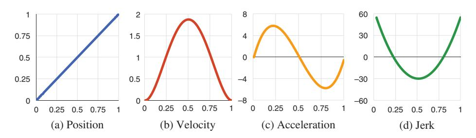

*Note.* Dynamics are plotted across time for one of the axes (both x and y profiles are identical).

predicted and what subjects produced)—potentially due to Todorov and Jordan's ad hoc formulation of the via-points—they found that the minimum jerk model was accurate in predicting the velocity profiles.

Although minimum jerk models focus on optimizing a single parameter (jerk), subsequent models have applied optimal control to parameters that include (a) the dynamics of the human motor system—notably, *minimum torque change* (Uno et al., 1989) and *minimum endpoint variation* (Harris & Wolpert, 1998); (b) feedback processes in the motor process—such as closed-loop corrective movements in *optimal feedback theory* (Todorov & Jordan, 2002); and (c) the underlying neurological process (e.g., Todorov, 2005). However, minimum jerk continues to be an appealing practical tool due to its simplicity and its ability to explain a wide range of experimental data in a concise computational method (Engelbrecht, 2001).

## 3. ROAD MAP

In this article we are building a descriptive model of gesture typing to explain and predict the characteristics observed in user input. Minimum jerk is a simple and well-supported theory for similar movements (e.g., drawing and handwriting) that can also be applied to gesture-typing movements. To do this we (a) demonstrate that a minimum jerk model can reproduce gesture-typing movement trajectories from users (Sections 4 and 5) and (b) extend the model to simulate new gesture trajectories using the statistical properties we find in user movements (Section 6).

Establishing a connection between gesture-typing movements and a minimum jerk model requires identifying the via-points of a user's gesture movement between which a trajectory will be simulated. Movement control models are typically evaluated by developing a method to select a set of via-points from an observed movement and measuring the ability of the model to reconstruct a trajectory between them (e.g., Edelman & Flash, 1987; Todorov & Jordan, 1998; Wada & Kawato, 1995). The following two sections describe our method for selecting via-points from a user's

gesture-typing movement and validate that a minimum jerk model can reconstruct the trajectory between them.

Once we have established that a minimum jerk model can successfully describe gesture-typing movements, we develop a method for simulating new gesture movements from an analysis of the stochastic properties of the via-points. The distributions made by the via-points capture properties of the underlying movement (such as sensorimotor noise and the speed–accuracy trade-off strategy), and by sampling from them, new gestures for arbitrary words can be generated.

## 4. THE PROCESS OF GESTURE TYPING

Gesture typing enables rapid text entry without close visual guidance or strict targeting constraints. This section examines the process of gesture-typing movements to understand the shape users are aiming to draw with their movements and the factors that influence movement production. This process deconstructs a gesture movement into a limited set of point-to-point movements that form the basis of the minimum jerk analysis in the following section. The process is developed from an analysis of the gesture-typing task rather than the underlying motor process. For simplicity we focus on the figural features of a movement and not its dynamics (i.e., velocity and acceleration), although we do mention the interaction with dynamics where appropriate and examine the dynamics profiles in the following section.

During gesture-typing tasks, users trace a path between the keys of the word they want to enter. The prototype gesture for this word is the path that connects the centers of its respective keys (e.g., [Figures 1](#page-2-0) and [5\)](#page-13-0). These movements share many features with those of aimed pointing (i.e., Meyer et al., [1988\)](#page-44-0) and could be analyzed as a series of concatenated aiming actions between the keys (e.g., Rick, [2010](#page-45-0)). However, there are two major features that distinguish gesture paths: (a) The movements between keys are not independent but are connected together in a continuous path, and (b) there are neither key boundaries that the gesture must enter nor actions to be performed to acquire each key in the word.

The accuracy of a gesture is determined by an overall match between the shape of a user's input with a prototype. Users only need to ensure that their traced path is closer to the prototype for the intended word than any other. The goal of gesturetyping recognition algorithms is to maximize the tolerance for deviation from an ideal prototype among a finite set of competing or distracting words with similar prototypes. To illustrate this, consider a gesture-typing interface that supports entry of only a single word. A user could draw any gesture to enter that word, as there are no competing prototypes—the accuracy in matching the shape of the prototype is irrelevant to identifying it. If support for a second word is added, a user must now draw a gesture that at least discriminates between the two competing prototypes by drawing a shape that is closer to one than the other. As more words are added, the gestures required gradually approach the prototype shape for an intended word—but the spacing of the keys and the diversity of prototype shapes (see Kristensson & Zhai, [2004,](#page-44-0) for an analysis) permit a certain amount of slack.

<span id="page-15-0"></span>
However, the tolerances of the system are not readily apparent to users. Although the visual interface for a gesture-typing keyboard usually shows key locations and key boundaries (which suggest certain location and accuracy requirements), users will quickly learn that these are not strict constraints when they draw gestures containing obvious errors that are still recognized by the system (such as failing to reach or pass through a key). Users are unlikely to produce a shape that exactly matches the prototype—rather, they will produce some deformation of it. [Figure 5](#page-13-0) shows several examples of these deformations from a data set of user gestures.<sup>6</sup>

The nature of this deformation is driven by factors that include the following:

- An inclination toward biomechanical fluidity that maximizes smoothness and minimizes effort in motor actions.
- A speed–accuracy trade-off strategy: choosing to produce faster but less precise gestures, or conversely slower but more precise gestures.
- Experience with a recognition system whose tolerances have been learned.
- The guidance offered by the user interface design—such as the visual representation of the keyboard.
- Online feedback from the system as users execute their movement—such as a trace of the path they've drawn so far, or a system's predictions about their intended word.

<span id="page-15-0"></span>
FIGURE 5. Samples of user gestures: Dashed lines indicate the prototype gesture and solid lines show the path drawn by a user.

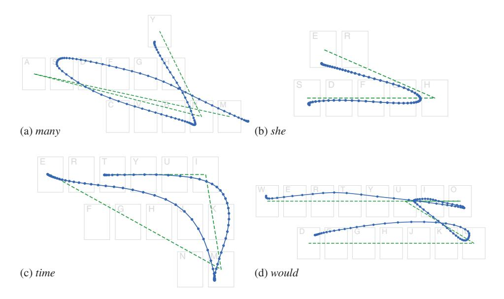

Note. Each point indicates an interval of 10 ms.

<sup>6</sup> Collection procedures are detailed in Section 5.3. All gesture examples in this article were selected from this data set.

- Mental slips and cognitive mistakes—such as spelling errors or hesitations.
- Natural error and sensorimotor noise in the motor system.

We are primarily interested in understanding the first of these in our model the maximization of smoothness and minimization of effort—but discuss how the others may be handled in Section 7.2.

To examine this deformation we follow the process that produces it: a user tracing a gesture shape in relation to the prototype it targets. This allows us to understand the production of a gesture in terms of a known quantity (the prototype), which is useful as a baseline for comparing different productions. The remainder of this section describes this process in three stages: (a) placing an initial touch point on the keyboard (where a gesture starts), (b) tracing a path between the keys that constitute a word, and (c) lifting from the keyboard to commit the gesture.

### 4.1. Initial Touch

Gesture production begins with an aimed pointing action toward the key representing the first character of an intended word. This pointing action is not required to land within the specific key boundary—but this does not mean there are no accuracy constraints in effect. Users will constrain their actions by the appearance of the key and the shape of the prototype. They can visually perceive a key boundary based on the position of neighboring keys and have a notion that the gesture should start near the center of the intended key. These accuracy suggestions draw the initial touch position toward the center of the intended key in a normal distribution (Bi, Li, & Zhai, [2013](#page-42-0); Wobbrock, Cutrell, Harada, & MacKenzie, [2008](#page-46-0), and revisited in Section 6.1), giving it an effective position and size across many gesture productions as if it were a well-defined target (e.g., Schmidt et al., [1979](#page-45-0)). The standard deviation of this distribution reflects the type of speed–accuracy trade-off in the aimed movement (typically modelled by Fitts' law or Schmidt's law), as seen in recent models for finger touches on mobile devices (e.g., Bi et al., [2013;](#page-42-0) Weir, Pohl, Rogers, Vertanen, & Kristensson, [2014;](#page-46-0) Weir, Rogers, Murray-Smith, & Löchtefeld, [2012](#page-46-0)).

### 4.2. Movement Between Keys

After the initial touch, a sliding action is made toward the key representing the next distinct character of the word. As with the initial aiming action, although the position and representation of the target key gives an indication of the direction that users should move toward, there are no fixed constraints. Furthermore, this sliding action between keys is not made in isolation from the rest of the gesture; rather, the shape of the path toward a key is influenced by: (a) properties of the path drawn so far (such as its direction and residual momentum), (b) the direction of the path after it reaches the key, (c) the posture of the user, and (d) the user's speed–accuracy tradeoff strategy.

<span id="page-17-0"></span>
[Figure 6](#page-18-0) illustrates several characteristic movements between three points that are observed in user gestures—[Figure 6a](#page-18-0) shows a direct path between each pair of points, and the others show a path where the movement between all three is considered more holistically:

- [Figure 6b](#page-18-0) shows a path that aims slightly above Target 2 in order to create a smooth curve when changing direction (cf. [Figure 5a](#page-15-0) between m-a-n).
- [Figure 6c](#page-18-0) shows an overshoot at Target 2, where residual momentum induces a wide curve around to Target 3 (cf. [Figure 5c](#page-15-0) between t-i-m).
- [Figure 6d](#page-18-0) shows a similar situation, but where a loop is used instead (cf. [Figure 5d](#page-15-0) between u-l-d).
- [Figure 6e](#page-18-0) shows a cusp at Target 2 from a constrained hand posture, for example, if a user was drawing the gesture with the thumb of the same hand holding the input device (cf. [Figure 5d](#page-15-0) between w-o-u).

We do not intend to build a complete taxonomy of corner shapes, or identify the cause of a user's decision to produce a particular one. Rather, we use these examples to highlight that the shape of a path between each key is likely to be informed by properties of the entire gesture being executed and the user's progress in doing so (Viviani & Cenzato, [1985\)](#page-46-0). Similarly, factors such as the user's hand posture may impose constraints that compel certain shapes.

As with the initial touch, if we assume that the goal of the movement is near the center of the next key by virtue of its representation (although we do not assume that users are targeting this point), then we can compare the path of the prototype to that of a user's movement to describe its deformation. For example, we described the

<span id="page-18-0"></span>
FIGURE 6. Exemplars of possible corner shapes when moving between three points.

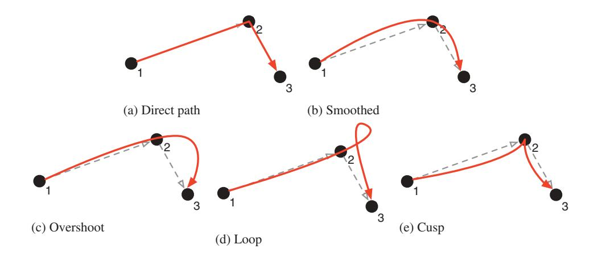

shapes in [Figures 6b](#page-18-0) to [6e](#page-18-0) above by comparing them to the direct path between the points. A quantitative method for this comparison is offered in the following section.

This sliding action is repeated for each of the remaining characters in the word, delimited by corners as a user completes an action to one key and begins an action to the next. The sliding action to a key is completed when a user determines that they have reached the target, that is, it is not prompted by any change in the system's feedback but by the users' own examination of their progress toward the target. It may be based on visual guidance from the underlying key locations and shapes (e.g., Andersen & Zhai, [2008](#page-42-0)), or a user's experience with the system. It may even be made prior to the movement reaching the key if, for example, a user executes a ballistic, open-loop movement with the expectation that it will reach the target key. In all cases, once a user decides that the key has been reached, their action shifts toward the next key in the word and begins a sliding action toward it.

Although a user's decision process is private, we can observe the external product of it: a corner or local maxima in curvature where the action shifts between keys. As with the initial touch, examining the distribution of these corners around a key identifies an effective location and size of the target key as if it were a well-defined pointing target.

### 4.5. Lift & Commit

Once a user determines that they have reached the terminal key in the word, they lift from the screen. The point at which they lift carries similar characteristics to the initial touch and corner points: It is determined when they decide they have reached the final key, and the distribution of these locations identifies an effective position and size of the terminal key.

### 4.6. Summary

Although the process for drawing a gesture-typing path is based around aimed movements between keys, the keys guide movement rather than constrain it. This section has described three core features of a gesture-typing movement (although we emphasize that these are post hoc figural properties and are not intended to be suggestive of the underlying processes that produce them): (a) the initial touch point; (b) the movements between keys, connected by corners; and (c) the lift point that completes the gesture. Each of these features is connected back to a feature of the prototype gesture effectively acting as a measure of the deformation between a prototype and a gesture produced by a user. The following section describes an algorithm for extracting these features from a movement sample and their application in a minimum jerk model.

## 5. A MINIMUM JERK ANALYSIS OF GESTURE TYPING

A minimum jerk model of motor control (as with most movement control models) uses via-points to define a movement task's essential position, time, and dynamics properties (often referred to as the task's boundary conditions or task constraints). To apply such a model, a set of via-points need to be defined that adequately describe the drawing task. Given a movement sample from a subject and a set of via-points selected from it, the model can be validated by its ability to reconstruct the sample's trajectory from only the via-points (i.e., the model is a suitable description of the process that created the sample).

Each via-point defines the properties of a movement at an instantaneous point in the task: (a) its position, (b) the time it is passed through (relative to the other points in the movement), and (c) the velocity and acceleration vectors (the dynamics) as it is passed through. As this article is primarily concerned with the shape of gesture-typing movements, we focus on identifying points of high figural significance and can optimize the others to minimize the total amount of jerk.

There is no single, accepted method for defining the via-points of a movement task or selecting them from a movement sample, and it is often done arbitrarily. However, selecting too few points will fail to capture the complex details of the task, whereas too many risks overfitting the model. For example, Wada and Kawato ([1995](#page-46-0)) algorithmically analyzed movement samples and iteratively placed via-points at the locations of greatest error to improve a model's fit. This produced a model with a good fit to empirical data but a specious placement of via-points. Conversely, Edelman and Flash ([1987](#page-43-0)) devised four basic shapes with predefined via-point structures that handwriting samples could be fit to and constructed from. This constrained the number and placement of via-points and allowed arbitrary words to be constructed from them.

This section describes a hybrid approach (e.g., Viviani & Flash, [1995](#page-46-0)) for identifying via-points in gesture-typing movements: An algorithm identifies the features described in the previous section from a movement sample and extracts them as its via-points (Section 5.1; e.g., [Figure 7\)](#page-17-0). This algorithm can be applied consistently across a collection of gesture samples to find a minimal set of via-points that are each associated with a specific feature of the prototype gesture (e.g., a letter of the word being entered).

Once the via-points of a gesture-typing movement sample are identified, they can be used to validate a minimum jerk model of gesture typing. Using the set of via-points, a complete trajectory can be found by minimizing the amount of jerk between them (Section 5.2). The model's ability to reconstruct the original movement sample from only its via-points provides support for our hypotheses that: (a) the gesture-typing process described in the previous section and algorithm's extracted via-points are a faithful representation of the basic gesture-typing task, and (b) the gesture-typing trajectories between via-points can be described by the minimum jerk theory (Section 5.3).

FIGURE 7. Examples of the via-point identification algorithm applied to gesture samples.

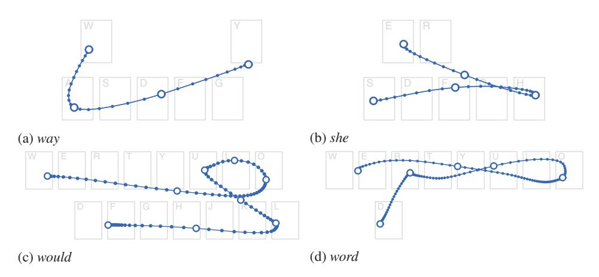

Note. Each point indicates an interval of 10 ms, with the enlarged, hollow points identified as via-points.

### 5.1. Via-Point Identification

The previous section discussed three features of a gesture-typing movement that can be identified and extracted as via-points: (a) the initial touch point; (b) the movements between keys, connected by corners; and (c) the lift point. The initial and lift points are trivial to identify, but the corners that connect them require an analysis of each gesture's shape.

For each character of a word being gestured (except the first and last), a user's movement (a) approaches from the prior character's key, (b) makes a corner near the target character's key, and (c) leaves toward the next character's key. We developed an algorithm to partition a gesture into segments that roughly capture the portion associated with these actions for each character of the word being entered and then identify a corner point within each segment to be the via-point for that character. Figure 8 shows several examples of this algorithm. Note that the divisions between segments occur approximately halfway between each key, and each segment captures the essential movement around each character in the word. However, we stress that these segments are not used to imply a motor planning or control strategy (cf. Guiard, [1993;](#page-43-0) Viviani & Cenzato, [1985;](#page-46-0) Viviani & Terzuolo, [1982](#page-46-0)) but are simply a convenient tool for analysis.

#### Segments

Given an ordered sequence of points describing a gesture, and an ordered sequence of characters for the word it represents, the following algorithm partitions the gesture's points into segments:

<span id="page-21-0"></span>
FIGURE 8. Examples of the segmentation algorithm: Gestures are partitioned into their respective character segments (distinguished by color and a gap), with the enlarged, hollow point within each segment identified as the corner via-point.

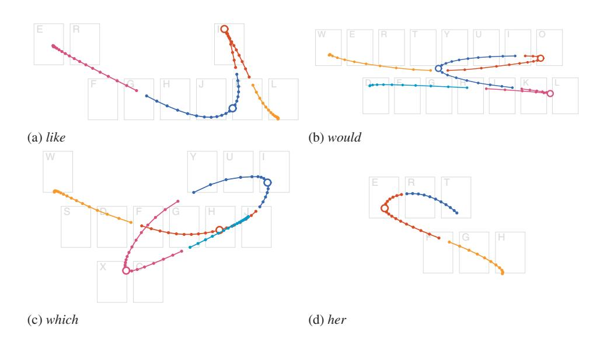

```
1: function SEGMENTS(gesture, word)
2:     points ← gesture except the first two and last two points
3:     keys ← KEYCENTRES(word)
4:     segments ← empty array
5:     for k ← 1 … |keys| − 1 do
6:         if keys_k = keys_{k+1} then continue
7:         segment ← empty array                             ⊳Points for keys_k
8:         d ← ∞
9:         for p ∈ points do
10:            d′ ← DISTANCE(p, keys_k)                      ⊳Euclidean distance
11:            if d′ < d or d′ < DISTANCE(p, keys_{k+1}) then
12:                append p to segment
13:                d ← d′
14:            else break                                    ⊳Segment for keys_k
                                                              complete
15:        remove all points in segment from points
16:        append segment to segments
17:    prepend first two points from gesture to segments[1]
18:    append [all remaining points and the last two points from gesture] to segments
19:    return segments
```

<span id="page-22-0"></span>
This algorithm has several important features:

- Neighboring repeated characters in a word are coalesced; for example, *jelly* is considered as *jely* (line 6).
- The first two and last two points are reserved for the segments of the first and last keys, respectively (line 2 and lines 17–18). This ensures that gestures where the first or last keys are not reached (observed in some cases where they were adjacent to the second or penultimate keys, respectively) are not rejected. For example, the gesture shown in Figure 10a moves toward the terminal *e* key but doesn't reach it—therefore, the last two points are reserved to form a line segment for the *e* key.
- The segment for each key is made from the points that either approach the key or are closer to it than the following key (line 11).
- The algorithm advances sequentially through each point in the gesture and each character of the word and does not backtrack.

#### Corner Points

Within each segment (except for the first and last), the point of highest curvature (Equation 1) is identified as its corner via-point—the point at which user action shifts from one key to the next. If no point in the segment has a curvature greater than 0.01, then the segment has no appreciable curvature and the point closest to the target key's center is selected instead. For example, the gesture for the word *out* is essentially rectilinear through *u*, even though users will produce it with a slight curve. Using the example in [Figure 9](#page-21-0), once divided into segments the maximum curvature across the segment through *u* is 0.0005 and therefore has no appreciable curvature; the point that is closest to the center of the *u* key is thus identified as the corner at *u* between *o* and *t* [\(Figure 9b](#page-21-0)).

#### Movement Between Corners

To better capture the shape of the movements between corners (exemplified in [Figure 6](#page-18-0)), the point closest to the curvilinear midpoint between corners is also extracted as a via-point. That is, between each pair of via-points just identified

FIGURE 9. An analysis of a gesture for the word *out*: The (a) raw gesture data is divided into segments, for which (b) the corner point at *u* is identified.

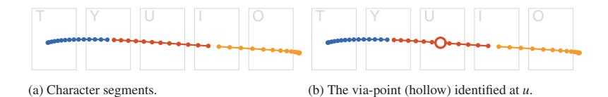

<span id="page-23-0"></span>
along the gesture (including the initial and lift points), the point halfway between them on the gesture's path is extracted as a via-point. This point is not captured if the keys associated with the via-point point pair are adjacent on the keyboard.

#### Error Gestures

Two tests ensure that a gesture minimally resembles the expected word: (a) Each segment must have at least two points (to form a line segment), and (b) each character point must be within 116 units (the distance between the centers of the A and W keys) of its target key's center. These tests identify the most egregious errors but still permit errors that may be difficult for a recognition algorithm to resolve (reviewed later).

#### Summary

[Figure 10](#page-22-0) shows an example of a gesture sample for the word *these* being processed by this algorithm to identify its via-points: three corner points (at *h*, *e*,

FIGURE 10. An analysis of a gesture for the word *these*: (a) divided into segments, (b) its corner points identified, (c) the midpoints between characters identified, and (d) its complete set of via-points.

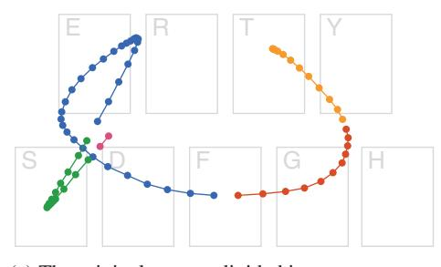

(a) The original gesture divided into segments.

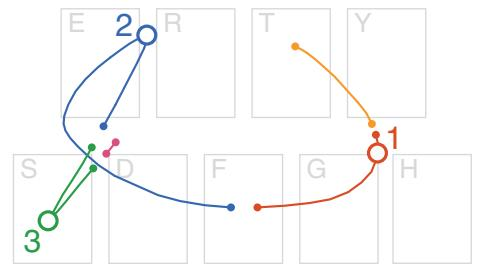

(b) Corner points (hollow markers) identified at (1) *h*, (2) *e*, and (3) *s*.

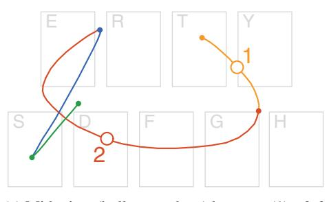

(c) Midpoints (hollow markers) between (1) *t* & *h*, and (2) *h* & *e* (all other key pairs are adjacent).

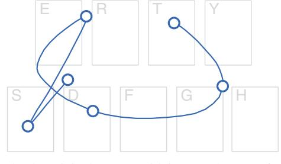

(d) The original gesture with its complete set of via-points (hollow markers).

and *s*), two midpoints between corners (between *t*-*h* and *h*-*e*), and two at its endpoints (at *t* and *e*). For a word of *n* keys (i.e., with neighboring repeated characters coalesced), one via-point is defined for each of its *n* characters, with up to *n* – 1 further points between its corners.

### 5.2. Applying Minimum Jerk Theory

If the extracted via-points sufficiently capture a gesture-typing movement task, and the minimum jerk theory is applicable to gesture-typing movements, then a trajectory from a user can be reconstructed from only its via-points. Similarity between the empirical and simulated trajectories will indicate that the essential properties of the task are captured in the via-points and that gesture typing movements can be described by the minimum jerk theory.

It is important to emphasize that via-points are not targets at which a user aims with some degree of accuracy: They are exact points sampled directly from a movement path. Across a collection of movement samples the via-points form distributions that may be modeled as targets (as we do in the following section), but the minimum jerk theory does not incorporate a model of a user's accuracy in producing a trajectory: The via-points are treated as constraints that must be met precisely. It is assumed that users produce an optimal trajectory between via-points, and any error is considered before they are selected (i.e., the selected via-points already reflect any speed–accuracy trade-off).

We have described a method for identifying the position of a set of via-points in a gesture sample (Section 5.1) but not the dynamics or passage time constraints at each via-point. Initially, these constraints can be obtained from the data itself: At each identified via-point, extract its position, dynamics, and passage time. However, the passage time and dynamics can alternatively be treated as free parameters. That is, given only the position of each via-point and the dynamics at the start and end points (typically null vectors), optimal dynamics at each intermediate via-point can be calculated by minimizing the sum of the jerk between each pair of them. Similarly, optimal passage times can be calculated by minimizing the total jerk cost from the position and dynamics properties (Todorov & Jordan, [1998](#page-45-0)). This will be used in the following section, where we build a stochastic model of via-point position but not the dynamics or passage times.

We therefore evaluated two versions of a minimum jerk (MJ) model that test two possible constructions for via-points:

- MJ1: Position, passage time, and dynamics were all extracted from the empirically collected gesture samples at the via-points just identified. This model provides support for the ability of the minimum jerk theory to describe the movements users make between the via-points.
- MJ2: Position is sampled from the data as with MJ1, but passage times and dynamics were calculated by minimizing total jerk (using the method just described from Todorov & Jordan, [1998](#page-45-0)). This model provides support for using optimal passage times and dynamics when there are no a priori constraints or model for them.

MJ1 predicts an optimal figural trajectory between via-points, whereas MJ2 also predicts the optimal passage time and dynamics at each via-point. However, users' gestures will be nonoptimal to some extent, for example, slips in motor control or mental preparation causing pauses, hesitations, or errors in shape. Modeling these cognitive and motor slips are beyond the scope of our analysis and are essentially error data (we discuss techniques for handling them later); however, they are also difficult to identify, as there is no rigorous definition for a correct gesture production.<sup>7</sup> Prior experiments have tried to limit the impact of similar errors by instructing subjects to draw many iterations of a closed shape (e.g., Viviani & Flash, [1995](#page-46-0)), or by employing the judgment of the experimenter (e.g., Edelman & Flash, [1987](#page-43-0)). We used the filtering test described earlier (which tests for obvious figural errors, but not errors in the dynamics), and expected that MJ1 would perform better than MJ2 as it samples all of its parameters from the empirical data.

### 5.3. Evaluating Minimum Jerk

#### Materials

We collected gesture samples using an application on a Samsung Galaxy Nexus (running Android 4.0).<sup>8</sup> The application displayed a noninteractive keyboard that matched the position and dimensions of the system's English keyboard. Short phrases of an individual word repeated four times were cued above the keyboard, and words were marked by asterisks as they were entered. To avoid the impact of recognition algorithm limitations or learning effects on subject behavior, no other feedback (e.g., input location or recognition accuracy) was given.

Fifty words of between two and five characters were randomly selected for the phrases from the 200 most frequently used English words (the same set of words and phrases were used across all subjects).

#### Participants

Forty volunteers took part in the study. They were between 18 and 59 years of age (M = 32), and five were left-handed. All had experience with text entry on mobile devices.

<sup>7</sup> In practice, gestures are ultimately validated for correctness by a gesture recognition system, but using such a system here would introduce a confound between our model of gesture production and the implicit model of the chosen recognition system and lexicon.

<sup>8</sup> Model I9250, with a 4.65-in. screen running at a resolution of 720 × 1280 pixels (316 ppi). Touch events were observed at a resolution of approximately 90 Hz but were mercurial and required resampling (see upcoming text).

#### Procedure

Instructions to subjects emphasized accuracy over speed (although no feedback about their accuracy was given). Subjects entered phrases in two postures: with their thumb and with their index finger (in a counterbalanced order). With each posture, subjects completed 10 warm-up phrases (data discarded) and then all remaining 40 phrases to produce 160 word–gesture samples (320 across both postures; 12,800 across all subjects).

#### Analysis

Each gesture was re-sampled at 100 Hz and had its x and y position series smoothed by fitting a quadratic spline (with at most n knots equal to the number of resampled points) to reduce the impact of sensor noise on our analyses. In particular, we found that hardware sampling jitter from tracking a sliding finger or thumb was particularly problematic when examining instantaneous changes in velocity or acceleration. Although this reduces the fidelity of the higher order time derivatives (velocity and acceleration), we found that it was necessary in order to prevent spurious changes in dynamics from introducing extremely large moments of error, and is consistent with prior analysis methodologies (e.g., Todorov & Jordan, [1998](#page-45-0)).

To avoid influence from any particular recognition algorithm, we did not check gestures for correctness or competence. However, on the basis of the test for error data described earlier, 592 gestures (4.63%) were excluded.

#### Evaluation Metrics

To quantitatively assess each model's ability to reconstruct subjects' gesture movements, we examined the figural similarities between empirical and reconstructed movements with a dynamic time-warping (DTW) distance metric, and their dynamic similarities by measuring the correlation between the dynamics profiles.

DTW (also known as elastic matching) measures the distance between two paths while remaining invariant to differences in their temporal properties (reviewed by Myers & Rabiner, [1981\)](#page-44-0). The paths are assumed to be nonlinearly scaled versions of each other, and a cumulative distance between corresponding points in each path is calculated (determined by finding the nonlinear scaling that minimizes said distance). DTW has been applied to speech and handwriting recognition (Myers & Rabiner, [1981;](#page-44-0) Tappert, [1982\)](#page-45-0), and was used in the gesture recognizer for the original SHARK algorithm (Zhai & Kristensson, [2003\)](#page-46-0). As our via-points are drawn from the original gesture, they are necessarily aligned in scale, rotation, and position. Therefore, DTW provides a simple metric for measuring the figural similarity between an empirical and simulated gesture that is invariant to their temporal differences (we use a version of the algorithm described for handwriting recognition by Tappert, [1982\)](#page-45-0). A DTW distance of zero indicates that there is no difference in path shape.

<span id="page-27-0"></span>
To measure the similarity in dynamics, we calculated Pearson's correlation coefficient r for the sequences representing the x and y position, velocity, and acceleration series of the simulated and empirical gestures (as used by Edelman & Flash, [1987](#page-43-0)). This quantifies the similarity of the respective profiles as the gesture unfolds—how similar the movements in position/velocity/acceleration are between the simulated gesture and the empirical gesture sample. A mean coefficient of 1 indicates that the trajectory movements in that series are identical.

To calculate these metrics (DTW and r), we applied the process described in Section 5.1 to extract the via-points for each gesture in our data set. At each via-point we extracted its position, passage time, and instantaneous dynamics vectors. We solved a minimum jerk model (for MJ1 and MJ2) between those via-points to produce a simulated trajectory (Equation 2), with points in the simulated trajectory evaluated at 100 Hz. This procedure yielded one empirical and two simulated gestures of equal length, with a strict time correspondence between their points.

Each of the simulated gestures were compared to their empirical original by calculating the average DTW distance between the points of the paths and by calculating the correlation coefficients across position, velocity, and acceleration for the x and y series. Each (x, y) pair of correlation coefficients were averaged to give a single metric.

To provide baselines for assessing these metrics, we also compared the empirical gestures with (a) prototype: a naïve gesture that matched the shape of the prototype for the intended word (between the key centres)—sampled at evenly spaced intervals and (b) via-points: a gesture made from the straight-line path between the extracted via-points of the empirical gesture. The differences between prototype and via-points highlight the fit from the extracted via-points, whereas the differences between via-points and MJ1/MJ2 highlight the additional fit from the minimum jerk model.

#### Results

[Figure 11](#page-23-0) summarizes the DTW and correlation (r) measures. DTW measures the average Euclidean distance between each path's points (for reference, each key

FIGURE 11. Dynamic time warping (DTW) distance geometric means, and arithmetic means for Pearson's correlation coefficients r (with standard deviations in parentheses) for each model.

| Model      | DTW          | Position  | Velocity  | Accel.    | Mean      |
|------------|--------------|-----------|-----------|-----------|-----------|
| MJ1        | 2.75 (1.86)  | .99 (.03) | .97 (.06) | .84 (.11) | .93 (.06) |
| MJ2        | 5.57 (1.58)  | .95 (.08) | .83 (.18) | .58 (.21) | .79 (.15) |
| Via-Points | 7.62 (1.55)  | .93 (.09) | .67 (.21) | .27 (.13) | .62 (.11) |
| Prototype  | 24.31 (1.52) | .91 (.10) | .62 (.23) | .24 (.13) | .59 (.11) |

had a size of 59 × 82), and a geometric mean is used to summarize the metric due to a positive skew in the data. In all cases, the minimum jerk simulations performed better than the baselines, and MJ1 performed better than MJ2. [Figure 12](#page-27-0) shows several representative examples of gestures and their minimum jerk simulations, and [Figure 13](#page-29-0) shows the corresponding dynamics profiles.

Overall, MJ1 and MJ2 models had lower DTW distances and stronger correlations than their baselines, and in many cases MJ1 produced gestures that were visually indistinguishable from the empirical original. Although MJ2 gestures had a weaker fit, these were rarely conspicuous figural differences. There were notable deviations in the dynamics profiles (particularly acceleration) for the minimum jerk models due to the simulated dynamics profiles being considerably smoother than those of the empirical data (illustrated in [Figure 13](#page-29-0)).

A significant portion of the positional fit was provided by the extracted via-points (the via-points baseline), as the movements between via-points were relatively straight. The improvement from the via-points baseline to the MJ1/MJ2 models is therefore attributed to the ability of the minimum jerk models to capture the features that connect via-points together—such as the cusps, loops, and other features illustrated in [Figure 6](#page-18-0). However, the baselines are impaired by their inability to reproduce the underlying dynamics (reflected in their poor correlation coefficients).

As expected, MJ2 was a weaker fit than MJ1, with its optimal estimates of passage times and dynamics producing smoother trajectories. MJ2 gestures generally had straighter lines and smoother corners than MJ1, and although the dynamics correlations were not particularly strong, the figural shape—our primary interest—was not significantly impaired by this. There were two notable areas of deviation we observed in MJ2 trajectories: (a) where one type of corner [\(Figure 6](#page-15-0)) in the empirical gesture was replaced with another (e.g., [Figure 14](#page-30-0)), and (b) where a subject corrected an error in their trajectory's dynamics (such as significant overshooting). However, the low overall mean and standard deviation for MJ2 DTW distance indicates that these cases were rare.

It is interesting to note that although minimum jerk seeks to maximize smoothness, it does not necessitate perfect smoothness. For example, [Figure 12a](#page-27-0) shows a sharp corner at h, which is reproduced in the minimum jerk version ([Figure 12c](#page-27-0)). Although sharp corners result in large change in jerk (from the deceleration and acceleration to reverse direction), a quick spike sometimes produces less total jerk than if the direction change was spread over a protracted path.

Examining the cases where MJ1 gave a poorer fit than the prototype revealed notable deviations for gestures where a subject made an error in their gesture's shape that they attempted to correct (such as skipping a key, or moving in the wrong direction, or a subject paused or hesitated with small, erratic movements before continuing. [Figure 15](#page-30-0) shows an example of a gesture where hesitations at several keys results in a poor MJ1 fit. These errors gave via-points with awkward dynamics (usually the MJ2 model was a better fit than MJ1). However, although these are arguably proper gestures (i.e., it would be desirable for a gesture recognition system to

<span id="page-29-0"></span>
FIGURE 12. Examples of gesture productions from the empirical data set (blue, solid) with (a, d, g, j) their corresponding prototypes (green, dashed), (b, e, h, k) MJ1, and (c, f, i, l) MJ2 simulations (red/orange, superimposed). Via-points are shown enlarged, and dynamic time warping distances are in parentheses.

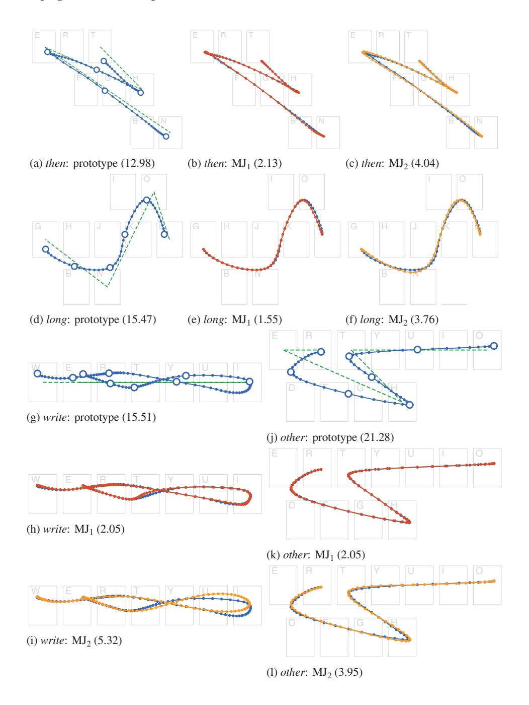

<span id="page-30-0"></span>
FIGURE 13. Dynamics (velocity and acceleration) profiles for the gestures in Figure 12 showing the empirical original (blue, solid) against MJ<sub>1</sub> (red, dashed) and MJ<sub>2</sub> (orange, dotted) simulations.

(a) *then* velocity (MJ<sub>1</sub> r = .99, MJ<sub>2</sub> r = .95) (b) *then* acceleration (MJ<sub>1</sub> r = .90, MJ<sub>2</sub> r = .83)
(c) *long* velocity (MJ<sub>1</sub> r = .99, MJ<sub>2</sub> r = .89) (d) *long* acceleration (MJ<sub>1</sub> r = .92, MJ<sub>2</sub> r = .79)
(e) *write* velocity (MJ<sub>1</sub> r = .99, MJ<sub>2</sub> r = .80) (f) *write* acceleration (MJ<sub>1</sub> r = .90, MJ<sub>2</sub> r = .55)
(g) *other* velocity (MJ<sub>1</sub> r = .99, MJ<sub>2</sub> r = .99) (h) *other* acceleration (MJ<sub>1</sub> r = .95, MJ<sub>2</sub> r = .85)

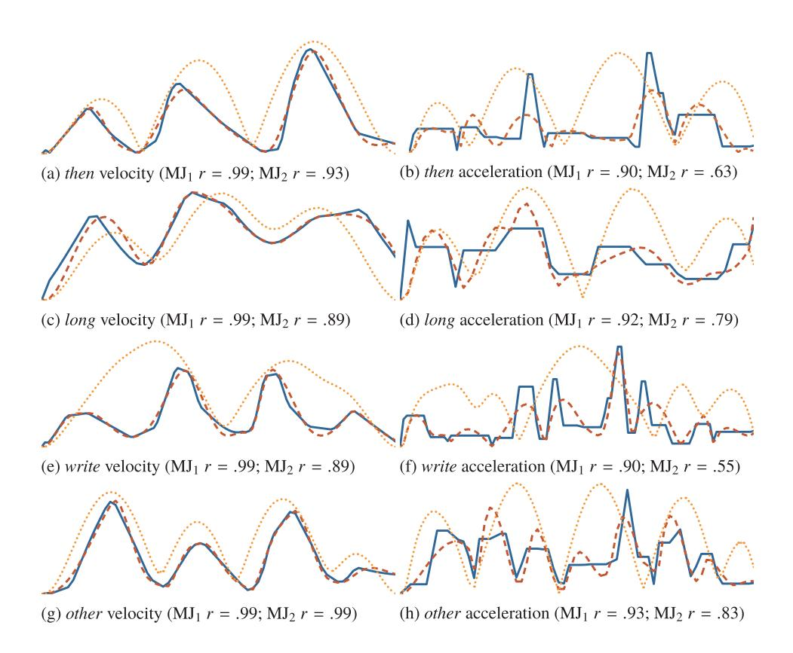

FIGURE 14. An example where different corner shapes are predicted for the word *these*. Note the loop at e and cusp at s in the (a) empirical original and (b) MJ<sub>1</sub> simulation are replaced by smooth corners in (c) MJ<sub>2</sub> (DTW distances are in parentheses).

(a) Prototype (25.54) (b) MJ<sub>1</sub> (3.09) (c) MJ<sub>2</sub> (11.74)

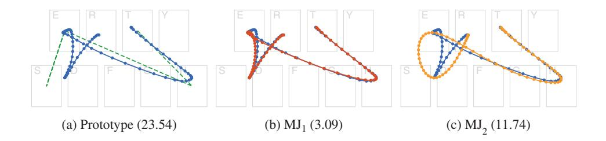

<span id="page-31-0"></span>
FIGURE 15. An example of a poor production for the word *which* against (a) the *prototype* baseline, (b) MJ<sub>1</sub>, and (c) MJ<sub>2</sub> simulations. Note the hesitation around the initial w, the slow path into h and around i, and the hook at the terminal h—which all appear exaggerated in the MJ<sub>1</sub> simulation.

(a) Prototype (23.54) (b) MJ<sub>1</sub> (c) MJ<sub>2</sub>

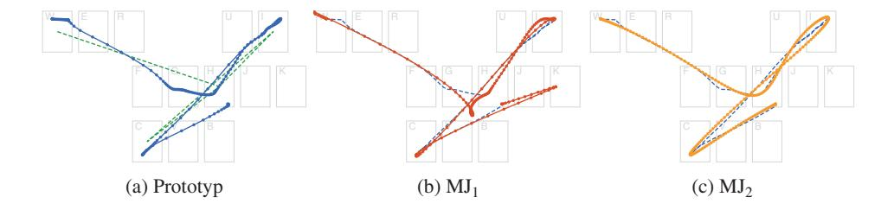

correctly recognize them), they are not indicative of those we are attempting to model.

#### Summary

By applying minimum jerk to the via-points extracted from empirically collected gesture samples, we have found a correspondence between the figural and dynamic properties of empirical gestures and their minimum jerk reconstructions. The low DTW distances and high correlations for MJ<sub>1</sub> provide support for our hypotheses that: (a) the via-points we identify and extract are a good description of a gesture-typing task and (b) the minimum jerk theory of movement control can describe the movements made by users during gesture typing from these via-points. The similar results for MJ<sub>2</sub> support the use of minimum jerk cost optimization as a reasonable method for estimating passage times and via-point dynamics.

## 6. SIMULATING GESTURE MOVEMENTS

As we have seen, there is a close fit between users' empirical gesture-typing movements and minimum jerk model simulations of those movements. This section describes a method for generating predictions of gesture-typing movements for arbitrary words that lack empirical data, based on the principles of minimum jerk. This is done by examining the stochastic properties of the via-points extracted from the gesture data collected earlier (Section 5.3) and finding that they create simple distributions around each key that reflect the underlying properties of the movement: the shape of the gesture, the speed–accuracy trade-off, and sensorimotor noise. Sampling from these distributions provides new via-points for arbitrary words and applying the minimum jerk model across those via-points produces trajectories that are reasonable predictions of the gestures that a user would draw.

<span id="page-32-0"></span>
### 6.1. Modeling the Distributions of Via-Points

The algorithm described in Section 5.1 selects a context-dependent via-point for each character in a word being gestured and an optional via-point between each nonadjacent pair of characters (illustrated in Figure 10). Here, we analyze the stochastic properties of these via-points with a view toward predicting them for new words.

#### Character Points

The via-points for each character in a gesture (the initial, lift, and corner points) are defined in terms of an offset from their target key's center location. Defining them in terms of this constant quantity—independent of the surrounding movement—allows them to be isolated and analyzed collectively.

Across a data set of gestures, these offsets create bivariate normal distributions around each key's center location (e.g., Figure 16). If users were aiming at each key in the word being gestured, this distribution would define the shape of a target for that key —with an effective position (its offset from the key centre) and size (a multiple of its standard deviation along each axis). Modeling these points with a bivariate normal distribution is consistent with similar analyses for the endpoints in aimed pointing tasks (e.g. Bi et al., 2013; Fitts, 1954; Meyer et al., 1988; Wobbrock et al., 2008). Although gesture movement tasks differ from aimed pointing tasks (see Section 4), there is good reason to believe that similar properties are expressed in these distributions (Cao & Zhai, 2007).

FIGURE 16. The distribution of corner points around the e key (illustrated by the red rectangle) when the adjacent keys in the word being gestured are (a) w & r, (b) h & r, and (c) h & n.

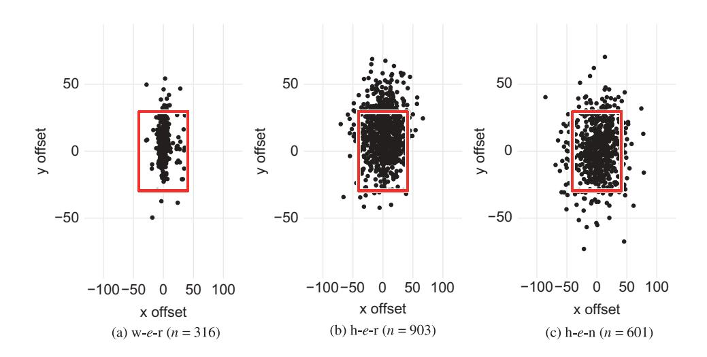

<span id="page-33-0"></span>
For a continuous process such as gesture typing, it is important to consider the context of the word being drawn when examining these distributions. That is, the location and direction of the incoming and outgoing paths for each key in a word influences the distribution of via-points. For example, [Figure 16](#page-31-0) shows distributions of via-points around the e key. Note the differences in distribution shape when the prototype between the adjacent keys would form a rectilinear line [\(16a\)](#page-32-0), a wide angle ([16b\)](#page-32-0), or a tight angle ([16c](#page-32-0)).

To empirically assess the fit of bivariate normal distributions as a model for these offsets, we examined the mean of the correlation coefficients of Q–Q plots (Filliben, [1975\)](#page-43-0) for normal distributions across each of the abscissa and ordinate axes. For the distributions across all keys, we found r > .99 for initial, lift, and corner point offsets. For each of the key pairs and triplets (e.g., [Figure 16](#page-31-0)) in our data set, and for each type of viapoint (initial, corner, and lift), we found similar results (mean r = .99, SD = 0.008).

#### Movement Shape

To better capture the movement between character points, our algorithm (Section 5.1) selects the midpoint of the curvilinear path between nonadjacent character points as a via-point. This point captures some of the error in a user's aim when sliding between character points. Rather than examine the position of these points, we examine the angle created between two vectors: (a) from the prior character point to the next key's center, and (b) from the prior character point to the midpoint (illustrated in [Figure 17\)](#page-32-0)—a measurement that is independent of the keys involved.

These angles can be modeled with a normal distribution for both those starting from an initial (r = .92) or character point (r = .93). However, these fits are adversely affected by a few obvious error cases. The most extreme values are –179.2º and +172.80º, indicating gestures that moved almost completely opposite to the task direction. However, the overall sample mean of –0.26º and standard deviation of 11.59º indicates that these cases are extreme outliers (e.g., due to misspellings or other sensorimotor slips). Removing the most extreme 1% of the data at each end

FIGURE 17. The angle to midpoint 2 in Figure 10c (the segment between h and e), θ: created between vectors from the corner point at h to (1) the midpoint and (2) the next key's centre.

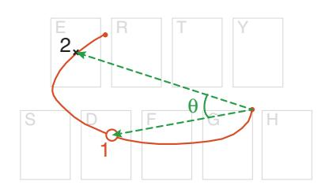

clips the spurious values and improves the fit of a Normal distribution (r = .79, with similar results for each pair of keys; SD = 0.01).

### 6.2. Generating Gesture Simulations

The close fits between the properties of the via-points extracted from our data set and simple statistical distributions offers a method for selecting new via-points by sampling from those distributions. That is, isolating the via-points at a particular key gives a fitted bivariate normal distribution from which new via-points for that key can be sampled. Given an arbitrary word, a set of via-points can be found by sampling offsets for each of the characters in the word and movement shape angles between each pair. Between these sampled via-points a minimum jerk model gives a complete trajectory.

It is important to emphasize the role of the context provided by preceding/ succeeding keys and their effect on the shape of a via-point distribution (e.g., [Figure 16\)](#page-31-0). Via-points are ideally sampled from distributions created from as much context as possible—as a via-point for a key is not independent of its neighboring keys. However, aggregate distributions can be used as a fallback given their reasonable fit. For example, sampling an offset for the letter w in the word two can come from the distribution of via-points at w between t and o, the distribution for via-points at w, or the distribution of all via-point offsets.

The movement shape via-points can be derived by sampling angles from the appropriate fitted normal distributions (with the available context) and selecting a point halfway between each of the sampled character points that re-create the angle from which the distributions were drawn.

The duration of the movement is of unit length (t<sup>0</sup> = 0, t<sup>f</sup> = 1), as the minimum jerk theory does not predict a movement's duration, nor is it affected by the absolute duration of a movement (only the relative durations between via-point movements affects the shape of the trajectory). The speed–accuracy trade-off that may have been expected to be manipulated by movement duration is instead manipulated through the shape of the via-point distributions (this issue is revisited in the discussion).

Given a set of sampled via-point locations, the dynamics and passage times at each can be estimated using the optimization method described for MJ2 (with null dynamics vectors at the start and end points; Todorov, [1998](#page-45-0)). Between these viapoints, a minimum jerk solution gives a complete trajectory. On the basis of the minimum jerk validation in the previous section, this trajectory is representative of one that a user would undertake were they to select the sampled via-points to enter the given word. The relative likelihood that a user would select those via-points can be calculated from the probability density functions of the fitted distributions.

#### Tuning the Model

The bivariate normal distributions for character points represent an error model for the sample of subjects whose movements were analyzed (cf. Wobbrock et al., [2008](#page-46-0)). That is, the parameters of these distributions will vary with the population from which the samples are collected—allowing the model to be tuned by controlling this population. For example, samples could be collected from users with specific levels of expertise in gesturing, under particular operating postures, with certain motor capabilities, or under specific instructions about speed or technique. Identifying the via-points and analyzing their distributions for these subject populations would produce gesture simulations that are representative of their selected characteristics.

### 6.3. Evaluating the Simulations

Examples of the gestures that can be generated by this model (fitted from our data set) are shown in [Figures 2](#page-2-0), [18](#page-33-0), and 19. Although it is easy to see that these gestures carry many of the characteristics observed in the gestures from our data set and are qualitatively realistic, this is difficult to quantify. For any gesture generated by the model, it is expected to have a stochastic resemblance to the prototype and to any samples for the same word from users, but it is not expected to match any single sample exactly. Although the similarity between sets of gestures can be measured (e.g., DTW distance), it is unclear what the criteria should be for an acceptable resemblance.

Galbally, Fierrez, Ortega-Garcia, and Plamondon ([2012](#page-43-0)) discussed this problem for a signature generation model built on similar principles and proposed three requirements for measuring the realism of simulated trajectories:

- Qualitative appearance: The simulations should look similar to those produced by users.

FIGURE 18. Examples of simulated gestures for words that were part of the data set (cf. Figures 5a and 8a).

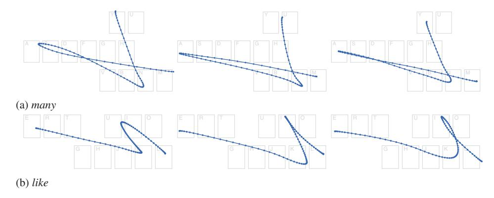

Note. Each point represents 1% of the gesture's time.

FIGURE 19. Examples of simulated gestures for words that were not part of the data set.

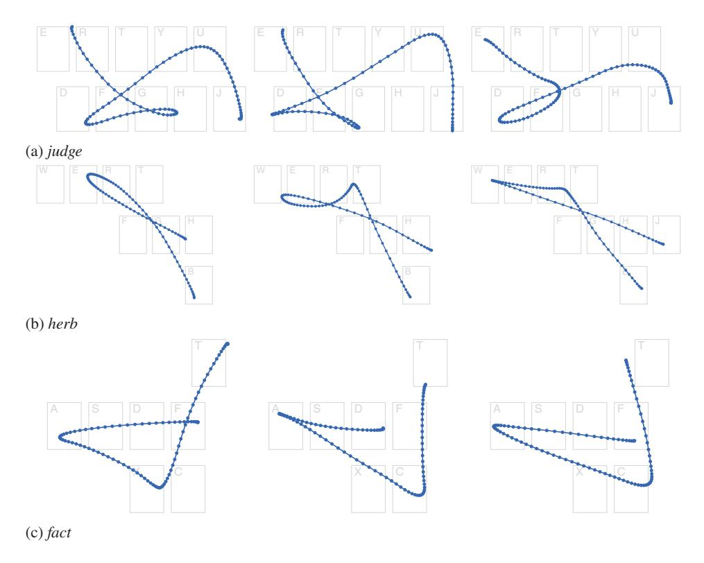

(a) judge, (b) harsh, (c) other

Note. Each point represents 1% of the gesture's time.

- Information content: The simulations should have the same "statistical characteristics" as those produced by users in their topological (i.e., geometry), spectral (timing and frequency), and kinematical (speed and acceleration) properties.
- Performance: The simulations should have the same inter- and intrauser variability as those produced by users.

Some support for the model's ability to fulfill such requirements can be assessed from the results already presented: Minimum jerk simulations are close in topology and kinematics to corresponding empirical gestures produced by users, and the viapoints form normal distributions that the model samples from to provide the same variability in simulations. Thus, the simulations have the same characteristics of the data its parameters are fit to. The via-points have also been identified at nonarbitrary locations through a principled analysis of gesture data, giving them context within the greater movement and allowing new points to be simulated for any input word.

In the absence of better quantitative methods, the simulations can also be examined in the context of the intended application area: gesture recognition. That is, user gestures and simulated gestures can be fed through a recognition algorithm to assess the similarity of their recognition characteristics (e.g., the rate of correct recognition). Although this does not establish the realism of the simulations generally, it does provide support for their practical utility by measuring their ability to produce similar results in an applied context.

To demonstrate this, we tested the model's ability to simulate gestures for words that are not part of the data used to find its parameters with a k-fold cross-validation against our data set (collected in Section 5.3). Our data set for 40 words was randomly partitioned into 10 subsets: Each subset consisted of four unique test words and the remaining 36 as training words (each word in the data set was a member of exactly one test subset). For each subset, the gesture data for the training words were used to find the parameters of the model (described earlier), and 320 gestures were simulated for each test word (the number of samples for each word in the original data set). This procedure generated a simulated version of the original data set from model parameters of an independent training set.

The simulated and original data sets were compared using a simple recognizer akin to SHARK (Zhai & Kristensson, [2003\)](#page-46-0), which is not confounded by any prediction or error correction features (Zhai & Kristensson, [2012](#page-46-0)). The recognizer matched each gesture to the word whose prototype had the lowest DTW distance to it, and its results are therefore interpretable as a measure of distance (rather than an interaction of the recognizer's features). A lexicon was compiled from the first 20,000 words in the Android Open Source Project English dictionary.9 For words with identical prototypes (e.g., asset and assert), only the first one read from the dictionary was included in the lexicon.

Of the gestures in the original data set, 69% were recognized correctly as their intended word, compared with 77% of their simulated counterparts. This shows that as far as the reference recognizer is concerned, the simulated gestures are around 10% more accurate than human-produced gestures. Given the small number of viapoints used, this is positive for the model. The improved performance is also expected: The simulated gestures are less noisy than human gestures, which have omissions and slips that are beyond the scope of the current model (discussed further in Section 7.2). There was a large, but similar, variance in the recognition rates between words, with a standard deviation of 19 percentage points for both the original and simulated gestures—primarily caused by words with prototypes that were nondescript (e.g., write) or easily confused (e.g., way vs. easy, will vs. wool, hot vs. hour) on the QWERTY keyboard layout. There was also a strong positive correlation in the recognition rates for each word between the two data sets (r = .83), indicating that well-recognized or poorly-recognized words in one set of gestures had similar performance in the other.

As mentioned, these measures do not assess the realism of the simulations but are merely measures of similarity in their recognition characteristics (a proxy for

<sup>9</sup> [https://android.googlesource.com/platform/packages/inputmethods/LatinIME/+/android-5.0.0_r1/dictionaries/en_US_wordlist.combined.gz](https://android.googlesource.com/platform/packages/inputmethods/LatinIME/+/android-5.0.0_r1/dictionaries/en_US_wordlist.combined.gz)

realism in the absence of better quantitative methods). The positive correlation for word recognition rates indicates that the model captures the production characteristics of each word that affects its recognition efficacy, and the recognition rate itself measures the degree of sensorimotor error captured.

The degree of sensorimotor error in both the original data set and the simulated gestures can also be expressed as the amount of deformation from the prototype shape. Recall that our analysis and subsequent model starts with a gesture prototype and deforms it through sensorimotor noise in a user's attempt to produce that prototype (see Section 4). This noise causes the accuracy of user-produced gestures to drop from a theoretical 100% to 69%. The via-point distributions are models of the aiming error around each key that are sampled to reproduce some of this noise. As these distributions do not consider all sources of noise (e.g., dynamics or cognitive slips), we expected the simulations to be closer to the prototype than user-produced gestures—but critically, no worse. This is observed in their recognition accuracy of 77%. The gap between the recognition rates for user-produced and simulated gestures is the noise that is missing from the model (see Section 7.2).

#### Summary

The via-points identified in the previous section form statistical distributions around the keys for each character of a word being gestured. By sampling from these distributions we have a method for selecting new via-points for arbitrary words and keyboard patterns, and a trajectory can be found by minimizing the jerk between them. This method comprises our generative production model of gesture-typing movements and produces gesture simulations that are qualitatively realistic and have similar quantitative performance characteristics to those produced by users.

## 7. DISCUSSION

We have shown that the movements made by users during gesture-typing tasks can be described by a minimum jerk model of motor control, and we have built a simple gesture production model that generates predictions of the movements that users will make for arbitrary gesture-typing tasks. These contributions have both theoretical and practical implications for designing and evaluating gestural input techniques, which we discuss in this section. We also discuss several limitations of our analyses (simplifying assumptions and approximations) and methods for addressing them.

### 7.1. Applications of the Model

Minimum jerk models (as with most movement control models based on minimization) predict a path and dynamics profile but do not predict the duration of a movement (the time it would take for a user to perform it). Rather, the duration of a movement is a fixed parameter, typically of unit-length (t<sup>0</sup> = 0, t<sup>f</sup> = 1), as the optimal trajectory between via-points does not change with duration—only the scale of its position and time axes does (as per the isogony principle). Furthermore, the unbounded optimal duration for a movement that minimizes jerk is infinite.

Instead, gesture performance models (such as the CLC model; Cao & Zhai, [2007](#page-43-0)) predict the time it would take for a user to draw a particular gesture shape. As reviewed (Section 2.2), these shapes are assumed to be close to the prototype shape as there have been no principled methods for deriving alternatives. Using our model, a varied set of realistic gesture shapes can be generated and used as the input to performance models—providing performance predictions that are more faithful to what users are likely to draw and capture the diversity of possible gesture shapes.

By repeatedly sampling the distributions of via-points, large sets of gestures can be simulated for any word—revealing the variety of possible trajectories that match the stochastic nature of real user gesture production. In addition to time performance, these sets can also be used to inform the design of the underlying prototype. For example, a gesture set for a particular prototype that has a large variance in linear extent or total jerk may indicate that it is difficult for users to draw or for an algorithm to recognize (due to a lack of consistency in the predicted productions). Particular points of difficulty may be identified by looking for areas with sharp corners (high curvature) or deviation from the prototype.

Similarly, gesture vocabularies can be designed to optimize common cases. For example, alternative gesture-typing layouts have been explored on the basis of their movement efficiency for tapping-based text entry (essentially minimizing the distance between common key pairs; e.g., Zhai, Hunter, & Smith, [2002](#page-46-0); Zhai & Kristensson, [2003](#page-46-0)) and gesture typing (e.g., Rick, [2010](#page-45-0); Smith et al., [2015](#page-45-0)). Using our model and minimum jerk theory, layouts can be explored on the basis of production efficiency: maximizing gesture smoothness or distinctiveness, and minimizing motor costs.

These sets of simulated gestures can also be used to improve tests of gesture recognition algorithms, or studies of language model adaptation within them. For example, by supplementing a set of empirical user-produced gestures with a set of simulated gestures that span the breadth of an input vocabulary (a gesture-typing lexicon), or by simulating a longitudinal study of many users to examine personalization effects (e.g., Fowler et al., [2015](#page-43-0)). The recognizer's efficacy with the simulated gestures provides a more comprehensive estimate of overall efficacy than can be feasibly captured empirically, and can be used to monitor and measure regressions as the algorithm is developed and tuned. Tuning the parameters of the model (Section 6.2) permits analyses of different user groups or behaviors.

### 7.2. Improving the Model

Our model uses stochastic via-point distributions to simulate the sensorimotor noise that pulls gesture movements away from their prototype shape. Although these distributions capture some types of noise—such as aiming errors and the speed– accuracy trade-off—there are other sources of noise that we have not considered. The model also assumes that users take an optimal course of action across their trajectory, that is, they make no slips, pauses, errors, or erratic corrective movements. The impact of these simplifications can be seen in the difference between the validation results for MJ1 (which used the dynamics from subjects' gestures) and MJ2 (which assumed optimal dynamics).

The relationship with aimed pointing (introduced in Section 4) can provide insights to improve these aspects of the model. In particular, we mentioned (Section 6.1) that the via-point distributions are consistent with the endpoint distributions of aimed pointing tasks and that these endpoint distributions are known to contain information about the speed–accuracy trade-off in such movements (Schmidt et al., [1979](#page-45-0)). Although there is no such trade-off in the minimization of jerk per se (as it predicts an optimal trajectory between fixed constraints), the trade-off has been modeled by the via-point distributions. Incorporating existing Fitts' or Schmidt's law-type models of similar movements (e.g., Bi et al., [2013;](#page-42-0) Weir et al., [2014,](#page-46-0) [2012](#page-46-0)) may improve the robustness of these distributions.

Except for short or highly practiced gestures, it is unlikely that users plan an entire movement prior to execution but instead progressively plan movements during execution (Viviani & Cenzato, [1985;](#page-46-0) Viviani & Terzuolo, [1982](#page-46-0))—producing artifacts in the dynamics where they slow down or stop to decide where and how they should continue. In gesture typing tasks this will be most noticeable in long words—where users need to mentally track their progress in spelling out the word. However, defining and deciding on the occurrence of these artifacts (or other types of errors) is difficult, as a fundamental characteristic of gestural input is that the shape produced by a user is a deformation of the prototype. Some of the deformation is an integral part of a correct and purposeful movement, whereas slips or planning decisions introduce errors that cause the movement to be unintentionally deformed. In our model, the constraints of dynamics and passage time are free parameters that we optimize to minimize the total amount of jerk, but replacing these free parameters with models of gesture dynamics could improve the model by removing the assumptions of optimal action.

Better models of movement dynamics—particularly around the planning and execution of long movements, or the introduction of errors—could also be used to broaden the range of errors that are modeled. For example, the midpoint between characters was selected as a via-point to capture some of the directional error in aiming at a key and some of the error in the dynamics at the adjacent corners. Although this was successful in modeling movements that were relatively direct (and therefore close to optimal), it fell short when they contained significant deviations or corrective actions. It is desirable that this via-point be removed altogether by a model of the dynamics at each character via-point—which would subsequently inform the shape of the path between them.

One approach for developing a dynamics model was explored by Ramsay and colleagues (Ramsay, [2000](#page-45-0); Ramsay & Silverman, [2002\)](#page-45-0), who used a functional analysis to fit differential equations to the dynamics series of handwriting samples. These equations were used to reproduce a handwriting sample, and classify different writers by comparing their models. Although these models were not used to simulate new samples, the approach may be amenable to simulation as part of an optimal control model.

In addition to motor noise, there are also cognitive effects that influence gesture production. These include general effects such as mental slips (Norman, [1981](#page-44-0)) that unintentionally introduce or omit actions (e.g., spelling errors) and errors that can be introduced by the task-specific cognitive architecture. For example, Rumelhart and Norman ([1982](#page-45-0)) studied and categorized several types of general typing errors, including entry of neighboring keys and letter-swapping within a word. Similar types of errors are likely to occur in gesture typing but are difficult to identify due to the tolerances allowed in gesture production.

Some simple cases of mental or cognitive slips may be predictable with the model as it stands by introducing intentional errors into the word being simulated. For example, simulated gestures for the word time could be supplemented with gestures for 'tome,' 'thime,' or 'tme.'

### 7.3. Alternative Control Models

The minimum jerk theory has been successful in describing many types of human movement, it is conceptually simple to reason about, and it is practically simple to apply. However, minimum jerk is a descriptive theory—it does not attempt to simulate the underlying process of planning and executing a trajectory, nor is it parameterized by any biological constraints. Trajectories that are not physically possible to execute can be computed if via-points are not carefully selected to ensure they are within the limits of the human motor system. These limitations could be relieved by better models of the constraints involved or by applying control models of the underlying motor processes.

Other models of motor control have been developed to address some of these limitations by including features of the motor planning and control process (see reviews by Campos & Calado, [2009](#page-43-0); Engelbrecht, [2001](#page-43-0); Flash & Sejnowski, [2001](#page-43-0); Plamondon et al., [2014;](#page-45-0) Wolpert, [1997\)](#page-46-0) and the role of feedback (Diedrichsen, Shadmehr, & Ivry, [2010;](#page-43-0) Todorov & Jordan, [2002](#page-45-0)) or duration (Tanaka, Krakauer, & Qian, [2006](#page-45-0)).

Some of these models apply the principles of optimal control with new accounts of the human movement problem (Hoff & Arbib, [1993\)](#page-44-0). For example, the minimum torque-change model minimizes the square of the change of torque, as calculated by a model of the musculoskeletal system being operated (Uno et al., [1989](#page-45-0)), and the minimum endpoint variation model seeks to minimize the variation of the final position in the presence of noise corrupting the control signals of the sensorimotor system (Harris & Wolpert, [1998\)](#page-43-0). Recently, optimal feedback control theory has incorporated closed-loop movements that correct deviations which interfere with the task goal
<span id="page-42-0"></span>
using models of feedback and sensorimotor strategy (Liu & Todorov, [2007;](#page-44-0) Todorov & Jordan, [2002\)](#page-45-0).

### 7.4. Conclusions

We have presented an analysis of the movements users make when performing gesture-typing tasks. Specifically, we traced a conceptual process of movement that is guided by the keys that represent the letters of the word being entered and identified the core features of its movement (its initial and lift points, and the corners that delimit the movements between keys).

When these features are extracted from a gesture movement sample (as via-points), we found that a minimum jerk model of motor control is able to simulate a trajectory between them that is a close match in both figural shape and dynamics with the original sample. We then analyzed the stochastic properties of these via-points and built a simple generative model by sampling fitted via-point distributions. This generative model produces realistic gesture trajectories for arbitrary keyboard patterns that are predictive of the movements that users are likely to make.

This model can be used to improve the evaluation of current gesture recognition systems and inform the design of new gestural input techniques. We believe that the principles and methods behind our model—the use of motor control models and the statistical analysis of via-points—are also likely to be applicable to a broader range of gestural input techniques.

## NOTES

HCI Editorial Record. First received January 27, 2015. Revisions received December 13, 2015, and June 21, 2016. Accepted by Stephen Payne. Final manuscript received July 11, 2016. — Editor

## REFERENCES

See [`references.md`](references.md).
